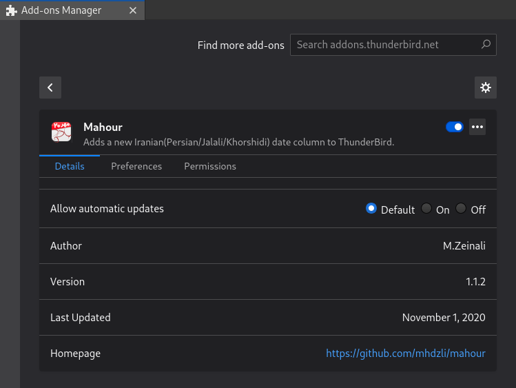

# ماهور

ماهور یک افزونه برای برنامه مدیریت ایمیل Thunderbird است که یک ستون تاریخ خورشیدی به این برنامه می‌افزاید. افزونه تاریخ فارسی [Iranian Date For Thunderbird](https://addons.thunderbird.net/en-US/thunderbird/addon/iranian-date-for-thunderbird/?src=ss){:target="_blank"}{:rel="noopener noreferrer"} که یک افزونه از نوع Legacy است پس از نسخه ۶۸ برای این برنامه کار نمی‌کند.

    

کد افزونه ماهور در <a href="https://github.com/mhdzli/mahour" target="_blank" rel="noopener noreferrer"><i class="fab fa-github"></i></a> در دسترس است.

## نصب افزونه

- نصب از [مخزن Mozila](https://addons.thunderbird.net/en-us/thunderbird/addon/mahour-iranian-date/){:target="_blank"}{:rel="noopener noreferrer"}
- دانلود و نصب دستی افزونه:
	- آخرین نسخه فایل `XPI` افزونه را از <a href="https://github.com/mhdzli/mahour/releases" target="_blank" rel="noopener noreferrer"><i class="fab fa-github"></i></a> دانلود کنید.
	- در صفحه `Add-ons Manager`  روی `Tools for all add-ons` (<i class="fa fa-cog"></i> <i class="fa  fa-chevron-down"></i>) کلیک کنید. با استفاده از گزینه ‪`Install Add-on From File...`‬ فایل دانلود شده را انتخاب و نصب کنید.

## ساختن فایل `XPI` افزونه از کد:

فایل‌های `XPI` فایلهای آرشیوی `ZIP` هستند که موزیلا از پسوند `xpi` برای آنها استفاده می‌کند.

- کد برنامه را از <a href="https://github.com/mhdzli/mahour/archive/master.zip" target="_blank" rel="noopener noreferrer"><i class="fab fa-github"></i></a> دانلود کنید و آن را از حالت فشرده خارج کنید یا از دستور `git clone https://github.com/mhdzli/mahour` استفاده کنید.
- در محیط ترمینال در پوشه `src` در کد افزونه با استفاده از دستور ‪`zip  -r mahour.xpi *`‬ فایل افزونه را بسازید.

## ساماندهی

    

- [x]  نمایش نام ماه به جای شماره ماه.
- [x] پنهان کردن زمان (با توجه به اینکه گاه از ستون تقویم میلادی همزمان استفاده می‌شود، شاید بخواهید نمایش زمان را در ستون تقویم خورشیدی پنهان کنید.).
- [x]  نمایش روز هفته. 
- [x]  شماره‌های انگلیسی به جای فارسی. 

برای دسترسی به ساماندهی‌های افزونه در صفحه Add-ons Manager روی Prefrences کلیک کنید.

- برنامه به روزرسانی بعدی: افزودن تاریخ خورشیدی به تقویم Thunderbitd.

    

## مجوز 

این افزونه با مجوز <a href="http://www.gnu.org/licenses/agpl-3.0.html" target="_blank" rel="noopener noreferrer">‪<i class="fa fa-balance-scale"></i>`GNU Affero General Public License v3.0‬</a> منتشر شده است.

## همکاری در پروژه

چنانچه مشکلی با این افزونه داشتید می‌توانید برای حل آن یک [`Issue`](https://github.com/mhdzli/mahour/issues){:target="_blank"}{:rel="noopener noreferrer"} باز کنید و یا برای من `PR` بفرستید که سپاسگزار خواهم شد.

برای آگاهی بیشتر درباره ساختن افزونه برای فایرفاکس [این پست](../mahour-update) را بخوانید.
