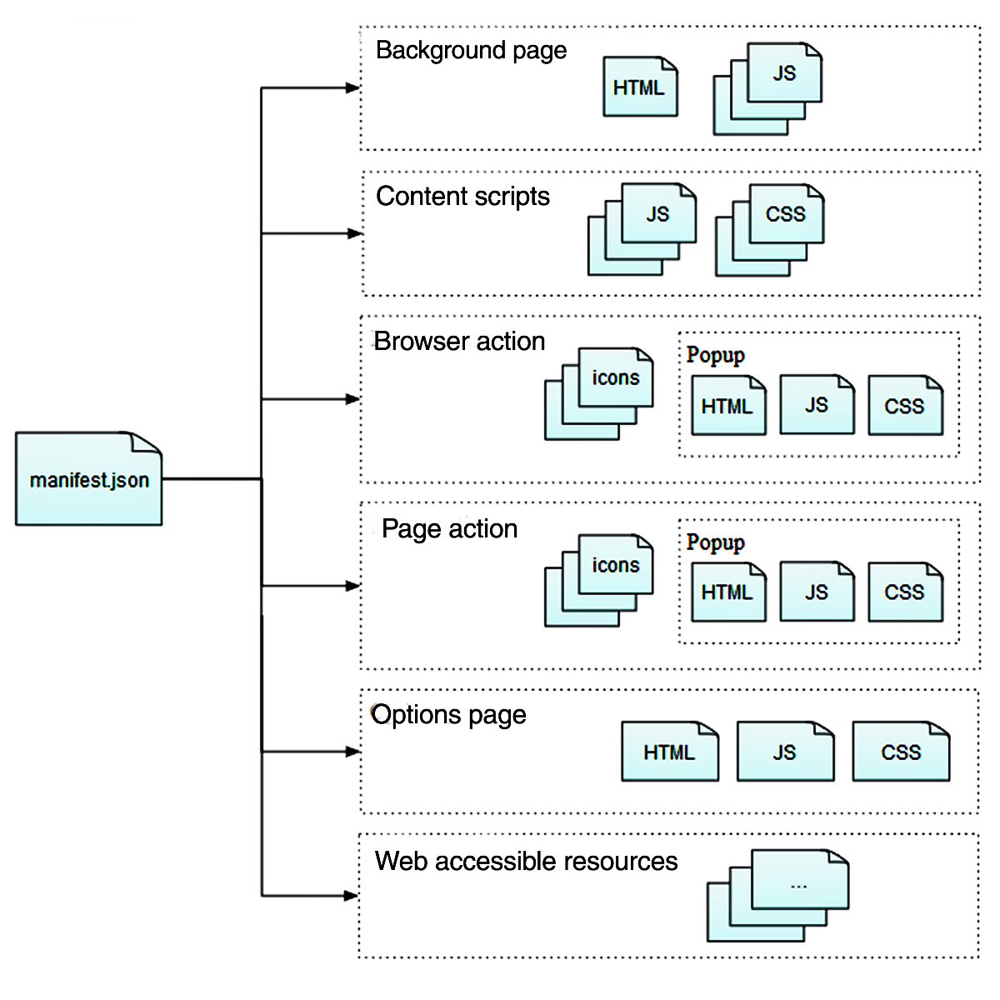

در این پست تلاش می‌کنم به بهانه به روزرسانی افزونه [ماهور](https://addons.thunderbird.net/en-us/thunderbird/addon/mahour-iranian-date/){:target="\_blank"}{:rel="noopener noreferrer"} کمی درباره افزونه‌های فایرفاکس و چگونگی ساخت یک افزونه برای فایرفاکس بنویسم.

# افزونه‌های فایرفاکس

تا پیش از نوامبر ۲۰۱۷ ابزارهای مختلفی برای ساخت یک افزونه فایرفاکس وجود داشت اما در نسخه‌های به روزتر برخی از آنها مانند ‫`overlay add-ons`‬، ‫`bootstrapped add-ons`‬، ‫`Add-on SDK`‬ و ... دیگر پشتیبانی نمی‌شوند. افزونه‌های جدید باید با استفاده از [WebExtensions API](https://developer.mozilla.org/en-US/docs/Mozilla/Add-ons/WebExtensions){:target="\_blank"}{:rel="noopener noreferrer"}ها ساخته شوند. اگر یک افزونه `Legacy` دارید برای سازگاری آن با نسخه های به روز فایرفاکس و ساخت `WebExtension` می‌توانید از [این راهنمای موزیلا](https://extensionworkshop.com/documentation/develop/porting-a-legacy-firefox-extension/){:target="\_blank"}{:rel="noopener noreferrer"} استفاده کنید.

## ساختار `WebExtension`ها

هر `WebExtension` یک فایل [`manifest.json`](https://developer.mozilla.org/en-US/docs/Mozilla/Add-ons/WebExtensions/manifest.json){:target="\_blank"}{:rel="noopener noreferrer"} دارد که ساختار، منابع و ویژگی‌های آن را مشخص می‌کند. عکس زیر ساختار کلی فایل `manifest.jason` را در یک `WebExtension` نشان می دهد.

    

نمونه فایل `manifest.json` افزونه ماهور:


{
  "manifest_version": 2,
  "name": "Mahour",
  "description": "Adds a new Iranian(Persian/Jalali/Khorshidi) date column to ThunderBird.",
  "version": "1.1.2",
  "homepage_url": "https://github.com/mhdzli/mahour",
  "author": "M.Zeinali",
  "applications": {
    "gecko": {
      "id": "mahour@zmim.ir",
      "strict_min_version": "68.0a1"
    }
  },
  "[experiment_apis](experiment_apis)": {
    "MahourDate": {
      "schema": "api/schema.json",
      "parent": {
        "scopes": ["addon_parent"],
        "paths": [["MahourDate"]],
        "script": "api/experiments.js"
      }
    }
  },
  "background": {
    "scripts": ["background/background.js"]
  },
  "browser_action": {
    "default_title": "ماهور",
    "default_popup": "popup/popup.html",
    "default_icon": {
      "48": "assets/icons/icon48.png"
    }
  },
  "options_ui": {
    "page": "options/options.html",
    "open_in_tab": false
  },
  "icons": {
    "32": "assets/icons/icon32.png",
    "48": "assets/icons/icon48.png",
    "64": "assets/icons/icon64.png",
    "128": "assets/icons/icon128.png"
  },
  "permissions": ["storage"]
}


این فایل دربردارنده کلیدهای زیر است:

- کلیدهای اساسی که بایست حتما تعریف شوند:
  - ورژن مانیفست ([`manifest_version`](https://developer.mozilla.org/en-US/Add-ons/WebExtensions/manifest.json/manifest_version){:target="\_blank"}{:rel="noopener noreferrer"})
  - نام افزونه ([`name`](https://developer.mozilla.org/en-US/Add-ons/WebExtensions/manifest.json/name){:target="\_blank"}{:rel="noopener noreferrer"})
  - ورژن افزونه ([`version`](https://developer.mozilla.org/en-US/Add-ons/WebExtensions/manifest.json/version){:target="\_blank"}{:rel="noopener noreferrer"})
- کلیدهای انتخابی:
  - توضیحات برنامه ([`description`](https://developer.mozilla.org/en-US/Add-ons/WebExtensions/manifest.json/description){:target="\_blank"}{:rel="noopener noreferrer"})
  - آیکون‌ها ([`icons`](https://developer.mozilla.org/en-US/Add-ons/WebExtensions/manifest.json/icons){:target="\_blank"}{:rel="noopener noreferrer"})
  - وبگاه یا مخزن افزونه ([`homepage_url`](https://developer.mozilla.org/en-US/docs/Mozilla/Add-ons/WebExtensions/manifest.json/homepage_url){:target="\_blank"}{:rel="noopener noreferrer"})
  - سازنده ([`author`](https://developer.mozilla.org/en-US/docs/Mozilla/Add-ons/WebExtensions/manifest.json/author){:target="\_blank"}{:rel="noopener noreferrer"})
- تنظیمات ویژه مرورگر ([`browser_specific_settings`](https://developer.mozilla.org/en-US/docs/Mozilla/Add-ons/WebExtensions/manifest.json/browser_specific_settings){:target="\_blank"}{:rel="noopener noreferrer"} یا در اینجا `applications`). ویژگی‌های مرورگر برای اجرای افزونه [چنانچه نیاز باشد](https://developer.mozilla.org/en-US/Add-ons/WebExtensions/WebExtensions_and_the_Add-on_ID#When_do_you_need_an_add-on_ID){:target="\_blank"}{:rel="noopener noreferrer"} در این کلید مشخص می‌شوند:
  - حداقل ورژن موتور ساخت محتوای مرورگر (`gecko`: content rendering engine)
  - شناسه افزونه برای موتور تولید محتوا (`gecko.id`)
- اسکریپت پس زمینه ([`Background scripts`](https://developer.mozilla.org/en-US/docs/Mozilla/Add-ons/WebExtensions/Anatomy_of_a_WebExtension#Background_scripts){:target="\_blank"}{:rel="noopener noreferrer"}): این اسکریپت در قالب یک صفحه ویژه به نام `background page` در پس زمینه اجرا می‌شود.
- اسکریپت‌های ساخت محتوا ([`Content scripts`](https://developer.mozilla.org/en-US/docs/Mozilla/Add-ons/WebExtensions/manifest.json/content_scripts){:target="\_blank"}{:rel="noopener noreferrer"}) که کار اصلی را بر عهده دارند و خوراک بخش‌های گوناگون افزونه را تولید می‌کنند. افزونه ماهور به جای این کلید از [`experiment_apis`](https://firefox-source-docs.mozilla.org/toolkit/components/extensions/webextensions/basics.html#webextensions-experiments){:target="\_blank"}{:rel="noopener noreferrer"} بهره برده است. اسکریپت تولید محتوا درون `API` بارگذاری می‌شود.
- رابط برنامه‌نویسی آزمایشی نرم‌افزار ([`experiment_apis`](https://firefox-source-docs.mozilla.org/toolkit/components/extensions/webextensions/basics.html?highlight=experiment_apis#webextensions-experiments){:target="\_blank"}{:rel="noopener noreferrer"}): با این کلید می‌توان یک رابط برنامه نویسی تازه برای استفاده در افزونه ساخت.
- صفحه‌های پیش فرض که مانند یک صفحه وب معمولی می‌توانند از فایلهای `css` و `js` استفاده کنند:
  - نوار کناری ([`Sidebars`](https://developer.mozilla.org/en-US/docs/Mozilla/Add-ons/WebExtensions/manifest.json/sidebar_action){:target="\_blank"}{:rel="noopener noreferrer"})
  - پنجره‌های بازشو (`popups`) ویژگی‌های مربوط به آن در کلید [`browser_action || page_action`](https://developer.mozilla.org/en-US/docs/Mozilla/Add-ons/WebExtensions/manifest.json/page_action){:target="\_blank"}{:rel="noopener noreferrer"} تعریف می‌شود.
  - سامان‌دهی (`options`): ویژگی‌های مربوط به آن در کلید [`options_ui`](https://developer.mozilla.org/en-US/docs/Mozilla/Add-ons/WebExtensions/manifest.json/options_ui){:target="\_blank"}{:rel="noopener noreferrer"} تعریف می‌شود. این کلید در صفحه `Add-ons Manager` گزینه `Preferences` را برای افزونه نمایان می‌کند. با کلیک کردن روی آن، صفحه ساماندهی در این بخش بارگذاری شده و امکان تغییر ویژگی‌های افزونه را فراهم می‌کند. (ست کردن ویژگی `open_in_tab` صفحه جدیدی برای بارگذاری باز خواهد کرد.)
- صفحه‌های افزونه ([`Extension pages`](https://developer.mozilla.org/en-US/docs/Mozilla/Add-ons/WebExtensions/user_interface/Extension_pages){:target="\_blank"}{:rel="noopener noreferrer"}): هر افزونه می‌تواند جدا از صفحه‌های پیش فرض، دربردارنده صفحه‌های ویژه خودش نیز باشد که اینجا تعریف می‌شوند.
- منابع مورد نیاز تولید محتوا ([`Web accessible resources`](https://developer.mozilla.org/en-US/docs/Mozilla/Add-ons/WebExtensions/manifest.json/web_accessible_resources){:target="\_blank"}{:rel="noopener noreferrer"}): چنانچه بخواهیم از فایل‌های ‫`HTML`‬، ‫`CSS`‬، ‫`JavaScript`‬ و ... در تولید محتوای افزونه استفاده کنیم آنها را در اینجا مشخص می‌کنیم. (نمونه: چنانچه افزونه نیاز دارد که عکس‌هایی را در صفحه‌های وب نمایش دهد، آنها را در اینجا مسیردهی می‌کنیم تا به آنها دسترسی داشته باشیم.)
- مجوزها ([`permissions`](https://developer.mozilla.org/en-US/docs/Mozilla/Add-ons/WebExtensions/manifest.json/permissions){:target="\_blank"}{:rel="noopener noreferrer"}): مجوزهای مورد نیاز برنامه با این کلید مشخص می‌شوند. برای مجوزهای اختیاری که نداشتن آنها جلوی اجرای برنامه را نمی‌گیرد از کلید [`optional_permissions`](https://developer.mozilla.org/en-US/docs/Mozilla/Add-ons/WebExtensions/manifest.json/optional_permissions){:target="\_blank"}{:rel="noopener noreferrer"} استفاده می‌شود.

### رابط برنامه نویسی افزونه‌ها

برای درک بهتر `API`های موزیلا و چگونگی استفاده از آنها [این راهنما](https://developer.mozilla.org/en-US/Add-ons/WebExtensions){:target="\_blank"}{:rel="noopener noreferrer"} را بخوانید.

در زیر نمونه یک `API` تعریف شده در فایل `manifest.json` را مشاهده می‌کنید.


{
  "manifest_version": 2,
  "name": "Extension containing an experimental API",
  "experiment_apis": {
    "apiname": {
      "schema": "schema.json",
      "parent": {
        "scopes": ["addon_parent"],
        "paths": [["myapi"]],
        "script": "implementation.js"
      },

      "child": {
        "scopes": ["addon_child"],
        "paths": [["myapi"]],
        "script": "child-implementation.js"
      }
    }

}
}


در هر `API` یک یا چند فضای نام تعریف می‌شود، که اشیا آن را می‌توان در اسکریپت‌های افزونه فراخوانی کرد. برای هر `API` باید یک `schema` تعریف شود که ویژگی‌های `API` را مشخص می‌کند. کلید `schema` در فایل `manifest.json` درون مسیر اصلی افزونه یک مسیر نسبی برای فایل `schema` مشخص می‌کند.

ویژگی‌های اصلی پردازش سرپرست (`parent process`) و پردازشهای فرزند (`child processes`) با کلیدهای `parent` و `child` در `script `مسیردهی می‌شوند.

در حال حاضر تنها گزینه‌های مجاز کلید `scops` برای مشخص کردن محدوده دسترسی هر فضای نام `addon-child` و `addon-parent` هستند.

فایل `schema` برای افزونه ماهور:


[
  {
    "namespace": "MahourDate",
    "functions": [
      {
        "name": "addWindowListener",
        "type": "function",
        "description": "Adds a listener 3pane windows",
        "async": false,
        "parameters": [
          {
            "name": "hich",
            "type": "string",
            "description": "hich"
          }
        ]
      },
      {
        "name": "changeSettings",
        "type": "function",
        "description": "Handle Prefrences",
        "async": true,
        "parameters": [
          {
            "name": "newSettings",
            "type": "object",
            "properties": {
              "longMonth": { "type": "boolean" },
              "showTime": { "type": "boolean" },
              "weekDay": { "type": "boolean" },
              "englishNumbers": { "type": "boolean" }
            }
          }
        ]
      }
    ]
  }
]


در این فایل برای فضای نام `MahourDate` دو تابع `addWindowListener` و `changeSettings` تعریف شده است. تابع نخست در زمان شروع برنامه یک `windowListener` برای کنترل نمایش ستون `تاریخ` به برنامه اضافه می‌کند. تابع دوم با عوض کردن تنظیمات برنامه ستون `تاریخ` را دوباره می‌سازد و نمایش می‌دهد.

> توجه: فراخوانی این توابع در `background script` باید با یک متغیر همراه باشد. بنابراین هر چند `addWindowListener` نیازی به ورودی ندارد، برای آن یک متغیر به نام `hich` (هیچ😂) تعریف شده است.

این توابع درون اسکریپت `api/experiments.js` تعریف شده‌اند، که در ویژگی `parent` رابط برنامه نویسی `MahourDate` در فایل `manifest.json` افزونه مسیردهی شده است.

فایل `experiment.js`:


// This Source Code Form is subject to the terms of the
// GNU General Public License, version 3.0.

"use strict";

var { Services } = ChromeUtils.import("resource://gre/modules/Services.jsm");
var { ExtensionSupport } = ChromeUtils.import(
"resource:///modules/ExtensionSupport.jsm"
);
var { ExtensionParent } = ChromeUtils.import(
"resource://gre/modules/ExtensionParent.jsm"
);

const EXTENSION_NAME = "mahour@zmim.ir";
var extension = ExtensionParent.GlobalManager.getExtension(EXTENSION_NAME);

//customizeable options
var monthStyle = "long";
var timeStyle = "2-digit";
var weekDayStyle = "hidden";
var numbersStyle = "arabext";

// Implements the functions defined in the experiments section of schema.json.
var MahourDate = class extends ExtensionCommon.ExtensionAPI {
onStartup() {}

onShutdown(isAppShutdown) {
if (isAppShutdown) return;
// Looks like we got uninstalled. Maybe a new version will be installed now.
// Due to new versions not taking effect (https://bugzilla.mozilla.org/show_bug.cgi?id=1634348)
// we invalidate the startup cache. That's the same effect as starting with -purgecaches
// (or deleting the startupCache directory from the profile).
Services.obs.notifyObservers(null, "startupcache-invalidate");
}

getAPI(context) {
context.callOnClose(this);
return {
MahourDate: {
addWindowListener(hich) {
// Adds a listener to detect new windows.
ExtensionSupport.registerWindowListener(EXTENSION_NAME, {
chromeURLs: [
"chrome://messenger/content/messenger.xul",
"chrome://messenger/content/messenger.xhtml",
],
onLoadWindow: paint,
onUnloadWindow: unpaint,
});
},
changeSettings(newSettings) {
if (newSettings.longMonth) {
monthStyle = "long";
} else {
monthStyle = "2-digit";
}
if (newSettings.showTime) {
timeStyle = "2-digit";
} else {
timeStyle = "hidden";
}
if (newSettings.weekDay) {
weekDayStyle = "long";
} else {
weekDayStyle = "hidden";
}
if (newSettings.englishNumbers) {
numbersStyle = "latn";
} else {
numbersStyle = "arabext";
}
for (let win of Services.wm.getEnumerator("mail:3pane")) {
win.MahourDate.MahourDateHeaderView.destroy();
win.MahourDate.MahourDateHeaderView.init(win);
}
},
},
};
}

close() {
ExtensionSupport.unregisterWindowListener(EXTENSION_NAME);
for (let win of Services.wm.getEnumerator("mail:3pane")) {
unpaint(win);
}
}
};

function paint(win) {
win.MahourDate = {};
Services.scriptloader.loadSubScript(
extension.getURL("content/customcol.js"),
win.MahourDate
);
win.MahourDate.MahourDateHeaderView.init(win);
}

function unpaint(win) {
win.MahourDate.MahourDateHeaderView.destroy();
delete win.MahourDate;
}


برای اینکه امکان فراخوانی توابع `addWindowListener` و `changeSettings` وجود داشته باشد، آنها را با الگوی مشخص شده در [راهنمای موزیلا](https://firefox-source-docs.mozilla.org/toolkit/components/extensions/webextensions/functions.html){:target="\_blank"}{:rel="noopener noreferrer"} و درون `getAPI(context)` تعریف کرده‌ایم.

تابع `addWindowListener` با eventهای `onLoadWindow` و `onUnloadWindow` به ترتیب توابع `paint` و `unpaint` را فراخوانی می‌کند. تابع `paint` با فراخوانی اسکریپت `content/customcol.js` محتوای ستون را تولید کرده و آن را نمایش می‌دهد. تابع `unpaint` نمایش ستون را متوقف و محتوای آن را پاک می‌کند.

مقدار پیش فرض متغیرهای قابل تنظیم برنامه در اینجا تعریف شده‌اند. در صورت تغییر آنها در صفحه ساماندهی افزونه تابع `changeSetting` با واسطه `background.js` فراخوانی شده و ستون تاریخ را دوباره می‌سازد و نمایش می‌دهد.

فایل `content/customcol.js`:


// This Source Code Form is subject to the terms of the
// GNU General Public License, version 3.0.
var { AppConstants } = ChromeUtils.import(
  "resource://gre/modules/AppConstants.jsm"
);
var { Services } = ChromeUtils.import("resource://gre/modules/Services.jsm");

const jalaliDateColumnHandler = {
init(win) {
this.win = win;
},
getCellText(row, col) {
var date = new Date(this.getJalaliDate(this.win.gDBView.getMsgHdrAt(row)));
var currentDate = new Date();

    //fixed options
    var yearStyle = "2-digit";
    var dayStyle = "2-digit";

    var locale = "fa-IR-u-nu-" + numbersStyle + "-ca-persian";

    var year = date.toLocaleString(locale, { year: yearStyle });
    var month = date.toLocaleString(locale, { month: monthStyle });
    var day = date.toLocaleString(locale, { day: dayStyle });
    var weekDay =
      weekDayStyle != "hidden"
        ? date.toLocaleString(locale, { weekday: weekDayStyle })
        : "";
    var time =
      timeStyle != "hidden"
        ? date.toLocaleString(locale, {
            hour: timeStyle,
            minute: timeStyle,
            hour12: false,
          }) + " ،"
        : "";

    //fix for bug that doesn't prepend zero to farsei
    if (time.length != 7 && timeStyle != "hidden") {
      var zero = numbersStyle === "arabext" ? "۰" : "0";
      time = zero + time;
    }
    var isCurrentYear;
    if (currentDate.toLocaleString(locale, { year: yearStyle }) == year) {
      isCurrentYear = true;
    } else {
      isCurrentYear = false;
    }
    var isCurrentDay;
    if (date.toDateString() === currentDate.toDateString()) {
      isCurrentDay = true;
    } else {
      isCurrentDay = false;
    }
    var isYesterday;
    var yesterdayDate = new Date();
    yesterdayDate.setDate(currentDate.getDate() - 1);
    if (date.toDateString() === yesterdayDate.toDateString()) {
      isYesterday = true;
    } else {
      isYesterday = false;
    }

    var placehodler;
    if (monthStyle === "long") {
      placeholder = "TT \u202BWD DD MM YY\u202C";
    } else {
      placeholder = "TT YY/MM/DD WD";
    }

    //remove year if it's current year
    if (isCurrentYear) {
      placeholder = placeholder.replace(/YY./, "");
    }
    //only show time if it's current day or yesterday
    if (isCurrentDay) {
      placeholder = "TT امروز";
    } else if (isYesterday) {
      placeholder = "TT دیروز";
    }

    dateString = placeholder
      .replace("YY", year)
      .replace("MM", month)
      .replace("DD", day)
      .replace("WD", weekDay)
      .replace("TT", time);

    return dateString;

},
getSortStringForRow(hdr) {
return this.getJalaliDate(hdr);
},
isString() {
return true;
},
getCellProperties(row, col, props) {},
getRowProperties(row, props) {},
getImageSrc(row, col) {
return null;
},
getSortLongForRow(hdr) {
return 0;
},
getJalaliDate(aHeader) {
return aHeader.date / 1000;
},
};

const columnOverlay = {
init(win) {
this.win = win;
this.addColumns(win);
},

destroy() {
this.destroyColumns();
},

observe(aMsgFolder, aTopic, aData) {
try {
jalaliDateColumnHandler.init(this.win);
this.win.gDBView.addColumnHandler(
"jalaliDateColumn",
jalaliDateColumnHandler
);
} catch (ex) {
console.error(ex);
throw new Error("Cannot add column handler");
}
},

addColumn(win, columnId, columnLabel) {
if (win.document.getElementById(columnId)) return;

    const treeCol = win.document.createXULElement("treecol");
    treeCol.setAttribute("id", columnId);
    treeCol.setAttribute("persist", "hidden ordinal sortDirection width");
    treeCol.setAttribute("flex", "2");
    treeCol.setAttribute("closemenu", "none");
    treeCol.setAttribute("label", columnLabel);
    treeCol.setAttribute("tooltiptext", "تاریخ خورشیدی");

    const threadCols = win.document.getElementById("threadCols");
    threadCols.appendChild(treeCol);

    // Restore persisted attributes.
    let attributes = Services.xulStore.getAttributeEnumerator(
      this.win.document.URL,
      columnId
    );
    for (let attribute of attributes) {
      let value = Services.xulStore.getValue(
        this.win.document.URL,
        columnId,
        attribute
      );
      // See Thunderbird bug 1607575 and bug 1612055.
      if (
        attribute != "ordinal" ||
        parseInt(AppConstants.MOZ_APP_VERSION, 10) < 74
      ) {
        treeCol.setAttribute(attribute, value);
      } else {
        treeCol.ordinal = value;
      }
    }

    Services.obs.addObserver(this, "MsgCreateDBView", false);

},

addColumns(win) {
this.addColumn(win, "jalaliDateColumn", "تاریخ");
},

destroyColumn(columnId) {
const treeCol = this.win.document.getElementById(columnId);
if (!treeCol) return;
treeCol.remove();
},

destroyColumns() {
this.destroyColumn("jalaliDateColumn");
Services.obs.removeObserver(this, "MsgCreateDBView");
},
};

var MahourDateHeaderView = {
init(win) {
this.win = win;
columnOverlay.init(win);

    // Usually the column handler is added when the window loads.
    // In our setup it's added later and we may miss the first notification.
    // So we fire one ourserves.
    if (
      win.gDBView &&
      win.document.documentElement.getAttribute("windowtype") == "mail:3pane"
    ) {
      Services.obs.notifyObservers(null, "MsgCreateDBView");
    }

},

destroy() {
columnOverlay.destroy();
},
};


محتوای اصلی ستون اینجا ساخته می‌شود و ستون جدید ایجاد می‌شود.

### اسکریپت پس زمینه

اسکریپت‌های پس زمینه به عنوان صفحه‌های ویژه مشخصه [`window`](https://developer.mozilla.org/en-US/docs/Web/API/Window){:target="\_blank"}{:rel="noopener noreferrer"} را با ویژگی [`Document Object Model`](https://developer.mozilla.org/en-US/docs/Glossary/DOM){:target="\_blank"}{:rel="noopener noreferrer"} دارند.

ویژگی‌های صفحه پس زمینه:

صفحه پس زمینه زمانی که افزونه مجوزهای لازم را داشته باشد، می‌تواند به `WebExtension API`ها دسترسی داشته باشد. همچنین با توجه به دسترسی به میزبان ([`host permissions`](https://developer.mozilla.org/en-US/docs/Mozilla/Add-ons/WebExtensions/manifest.json/permissions){:target="\_blank"}{:rel="noopener noreferrer"}) امکان فرستادن درخواست‌های `XHR` را دارد. برای آگاهی بیشتر در این زمینه کلید واژه `Cross-origin access` را جستجو کنید.

اسکریپت پس زمینه دسترسی مستقیم به صفحه‌های وب ندارد، اما می‌تواند اسکریپت‌های تولید محتوا ([`content scripts`](https://developer.mozilla.org/en-US/docs/Mozilla/Add-ons/WebExtensions/Content_scripts){:target="\_blank"}{:rel="noopener noreferrer"}) را در آنها بارگذاری کند و با استفاده از [`message-passing API`](https://developer.mozilla.org/en-US/Add-ons/WebExtensions/Content_scripts#Communicating_with_background_scripts){:target="\_blank"}{:rel="noopener noreferrer"} با آنها ارتباط برقرار کند. از این شیوه در افزونه ماهور استفاده شده است.

> نکته: اسکریپت‌های پس زمینه برای جلوگیری از دسترسی به کنش‌های نابجا محدودیت‌هایی نیز دارند. نداشتن توان فراخوانی `eval()` نمون‌ای از این محدودیت‌ها است.
> برای آگاهی بیشتر [`Content Security Policy`](https://developer.mozilla.org/en-US/docs/Mozilla/Add-ons/WebExtensions/Content_Security_Policy){:target="\_blank"}{:rel="noopener noreferrer"} را بخوانید.
> همچنین امکان فراخوانی `alert()`، `confirm()`، یا `prompt()` نیز در این صفحه وجود ندارد.

کد اسکریپت پس زمینه ماهور:


"use strict";

/_
Default settings. Initialize storage to these values.
_/
var datePrefrences = {
longMonth: true,
showTime: true,
weekDay: false,
englishNumbers: false,
};

/_
Generic error logger.
_/
function onError(e) {
console.error(e);
}

/_
On startup, check whether we have stored settings.
If we don't, then store the default settings.
_/
function checkStoredSettings(storedSettings) {
if (!storedSettings.datePrefrences) {
browser.storage.local.set({ datePrefrences });
}
}

function repaint(newSettings) {
browser.MahourDate.changeSettings(newSettings);
}

const gettingStoredSettings = browser.storage.local.get();
gettingStoredSettings.then(checkStoredSettings, onError);

/_ globals browser _/
var init = async () => {
browser.MahourDate.addWindowListener("hich");
};

init();


برای استفاده از ‪`browser.storage.local.get()`‬ و ‪`browser.storage.local.set()`‬ در فایل `manifest.jason` مجوز `storage` گرفته شده است. `MahourDate` شناسه `API` تازه این افزونه است. با استفاده از `browser.MahourDate.changeSettings(newSettings)` یکی از توابع آن برای اعمال تنظیمات فراخوانی می‌شود.

# به روز رسانی برای `Thunderbird` نسخه ۱۱۵ به بعد

در نسخه ۱۱۰ `Thunderbird` پشتیبانی از `Custom Culomn` متوقف شد و افزونه ماهور روی این نسخه از کار افتاد. با اضافه شدن `API` جدید در نسخه ۱۱۵ امکان به روز کردن کد و پشتیبانی از این نسخه‌ها فراهم شد. اگر دوست دارید بیشتر بدونید [اینجا](https://github.com/mhdzli/mahoor/issues/8) درباره‌اش گفتگو کردیم.

چون وقت کافی برای به روز کردن کدها نداشتم، کمی طول کشید، اما سرانجام ماهور نسخه‌های تازه‌تر تا ۱۲۸ را پشتیبانی می‌کند.

# منابع مفید:

اگر با ساخت افزونه‌ها آشنایی ندارید و تازه می‌خواهید شروع کنید این ویدیوی آقای شجاعی را ببینید:

  <iframe sandbox="allow-same-origin allow-scripts allow-popups" src="https://peertube.linuxrocks.online/videos/embed/d70182ca-9ea9-4411-bd24-86dcbff95ceb" frameborder="0" allowfullscreen></iframe>

برای تست افزونه‌ها روی Thunderbird در صفحه `Add-ons Manager`  روی `Tools for all add-ons` (<i class="fa fa-cog"></i> <i class="fa  fa-chevron-down"></i>) کلیک کنید. با انتخاب گزینه `Debug Add-ons` یک تب جدید باز می‌شود که در آن افزونه ها را می‌توانید موقتا نصب و امتحان کنید. کافی است روی `Load Temporary Add-on` کلیک کنید و فایل `manifest.json` افزونه را انتخاب کنید.

- [راهنمای توسعه رابط برنامه نویسی برای افزونه‌ها](https://firefox-source-docs.mozilla.org/toolkit/components/extensions/webextensions/index.html){:target="\_blank"}{:rel="noopener noreferrer"}
- [افزونه‌های مرورگر](https://developer.mozilla.org/en-US/docs/Mozilla/Add-ons/WebExtensions){:target="\_blank"}{:rel="noopener noreferrer"}
- [نمونه‌های ساده](https://github.com/mdn/webextensions-examples){:target="\_blank"}{:rel="noopener noreferrer"}
