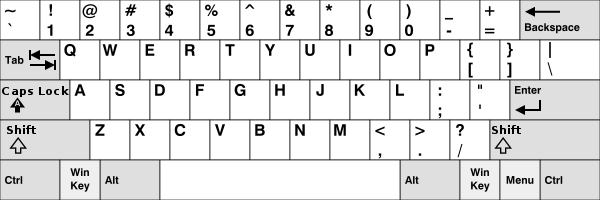
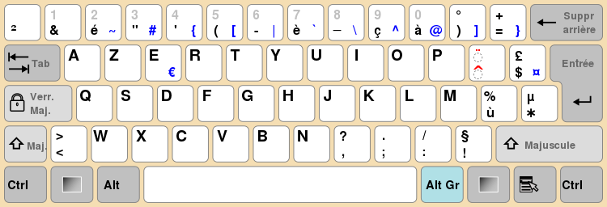
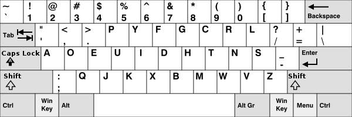
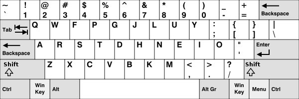
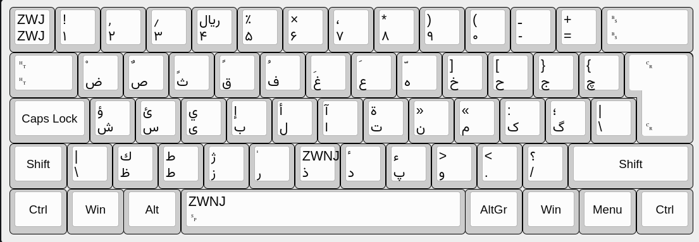
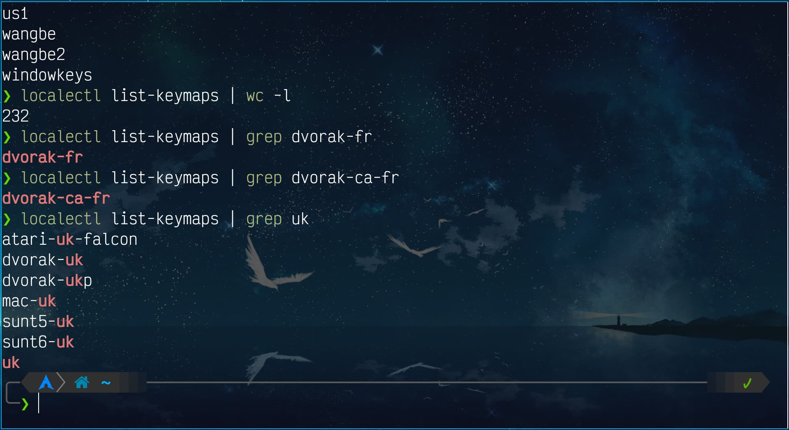

استفاده از دو زبان فارسی و انگلیسی برای کاربران فارسی رایانه ضروری است. پشتیبانی از زبان فارسی در گنو/لینوکس مدت‌هاست که افزوده شده و همواره استانداردهای بهتری به نسبت ویندوز داشته است. با این حال شخصی سازی بیشتر، همواره تجربه خوشایندتری در کار با رایانه برای ما خواهد داشت. استفاده از دو زبان همزمان و نبود استاندارد یکسان برای فارسی نویسی، موجب می‌شود کاربران فارسی زبان گاه با مشکلاتی مواجه شوند، که هرگز برای کاربران انگلیسی زبان پیش نمی‌آید. چندی پیش یکی از دوستان دنبال راهی برای افزودن یک نویسه خاص به صفحه کلید بود. اینکه نتوانسته بود راهنمای مناسبی برای این کار پیدا کند، موجب شد به فکر نوشتن یک مطلب در این زمینه بیفتم.

اینجا تلاش می‌کنم درباره تنظیمات صفحه کلید در محیط کنسول `tty` و محیط‌های گرافیکی `X11` و مدیر پنجره `Sway` روی ویلند بنویسم. تنظیمات صفحه کلید روی ویلند وابسته به کامپوزیتوری است که از آن استفاده می‌کنید. اما عمده آنچه اینجا به آن اشاره می‌شود، بر روی محیط‌های کاربری دیگر ویلند، به ویژه آنها که بر اساس `wlroots` هستند نیز فابل انجام است.

# تفاوت صفحه کلیدها و `layout`های مختلف

بیشتر ما از `layout` انگلیسی و فارسی `QWERTY` روی صفحه کلید استفاده می‌کنیم. که نمونه آن را در عکس زیر می‌توانید ببینید.

    

اما چیدمان‌های دیگری نیز برای صفحه کلیدهای `QWERTY` بسته به زبان صفحه کلید وجود دارد. به عنوان نمونه صفحه کلید فرانسوی `AZERTY` که تغییراتی را در صفحه کلید انگلیسی `QWERTY` برای سازگاری بیشتر با زبان فرانسوی داده است:

    

برای اطلاعات بیشتر در این زمینه می‌توانید صفحه مربوط به آن را در [ویکی‌پدیا](https://en.wikipedia.org/wiki/Keyboard_layout){:target="_blank"}{:rel="noopener noreferrer"} بخوانید.

همچنین چیدمان‌های دیگری نیز از صفحه کلید انگلیسی وجود دارد که [`DVORAK`](https://en.wikipedia.org/wiki/Dvorak_keyboard_layout){:target="_blank"}{:rel="noopener noreferrer"} و [`COLEMAK`](https://en.wikipedia.org/wiki/Colemak){:target="_blank"}{:rel="noopener noreferrer"} شناخته شده‌تر هستند.

نمونه صفحه کلید `DVORAK`:

    

نمونه صفحه کلید `COLEMAK`:

    

[صفحه کلید فارسی استاندارد](https://kbdlayout.info/kbdfar){:target="_blank"}{:rel="noopener noreferrer"} نیز نمونه‌ای از صفحه کلیدهای `QWERTY` دسته‌بندی می‌شود. که چیدمان کلید‌ها در آن به این صورت است:

    

# تنظیمات صفحه کلید در `tty`

شاید کمتر برای شما پیش آمده باشد که بخواهید تنظیمات صفحه کلید را در کنسول یا همان محیط `tty` تغییر دهید بیشتر ما از صفحه کلید انگلیسی `QWERTY` که بیشتر جاها پیش گزیده است، استفاده می‌کنیم. اما همانطور که اشاره شد، چیدمان‌های دیگری هم از حروف انگلیسی وجود دارد. این یکی از دلایلی است که ممکن است بخواهیم در محیط کنسول از یک `layout` متفاوت استفاده کنیم.

چنانچه از `Systemd` به عنوان راه‌انداز استفاده می‌کنید می‌توانید با فرمان `localectl list-keymaps` لیستی از چیدمان‌های موجود را ببینید. برای من خروجی این دستور ۲۳۲ صفحه کلید متفاوت را نمایش می‌دهد.


$ localectl list-keymaps | wc -l
232


همچنین می‌توانید با استفاده از `grep` صفحه کلید مورد نظرتان را بیابید:

    

در صورتی که از `Systemd` استفاده نمی‌کنید، دستور `find` می‌تواند لیستی از صفحه کلیدهای موجود را به شما بدهد. خروجی آن برای من به این صورت است:


$ find /usr/share/kbd/keymaps/ -type f -name "*"
/usr/share/kbd/keymaps/amiga/amiga-de.map.gz
/usr/share/kbd/keymaps/amiga/amiga-us.map.gz
/usr/share/kbd/keymaps/atari/atari-de.map.gz
/usr/share/kbd/keymaps/atari/atari-se.map.gz
/usr/share/kbd/keymaps/atari/atari-uk-falcon.map.gz
/usr/share/kbd/keymaps/atari/atari-us.map.gz
/usr/share/kbd/keymaps/i386/azerty/azerty.map.gz
/usr/share/kbd/keymaps/i386/azerty/be-latin1.map.gz
/usr/share/kbd/keymaps/i386/azerty/fr-latin1.map.gz
/usr/share/kbd/keymaps/i386/azerty/fr-latin9.map.gz
/usr/share/kbd/keymaps/i386/azerty/fr-pc.map.gz
/usr/share/kbd/keymaps/i386/azerty/fr.map.gz
/usr/share/kbd/keymaps/i386/azerty/wangbe.map.gz
/usr/share/kbd/keymaps/i386/azerty/wangbe2.map.gz
/usr/share/kbd/keymaps/i386/bepo/fr-bepo-latin9.map.gz
/usr/share/kbd/keymaps/i386/bepo/fr-bepo.map.gz
/usr/share/kbd/keymaps/i386/carpalx/carpalx-full.map.gz
/usr/share/kbd/keymaps/i386/carpalx/carpalx.map.gz
/usr/share/kbd/keymaps/i386/colemak/colemak.map.gz
/usr/share/kbd/keymaps/i386/dvorak/ANSI-dvorak.map.gz
/usr/share/kbd/keymaps/i386/dvorak/dvorak-ca-fr.map.gz
/usr/share/kbd/keymaps/i386/dvorak/dvorak-es.map.gz
/usr/share/kbd/keymaps/i386/dvorak/dvorak-fr.map.gz
/usr/share/kbd/keymaps/i386/dvorak/dvorak-l.map.gz
/usr/share/kbd/keymaps/i386/dvorak/dvorak-la.map.gz
/usr/share/kbd/keymaps/i386/dvorak/dvorak-no.map.gz
/usr/share/kbd/keymaps/i386/dvorak/dvorak-programmer.map.gz
/usr/share/kbd/keymaps/i386/dvorak/dvorak-r.map.gz
/usr/share/kbd/keymaps/i386/dvorak/dvorak-ru.map.gz
/usr/share/kbd/keymaps/i386/dvorak/dvorak-sv-a1.map.gz
/usr/share/kbd/keymaps/i386/dvorak/dvorak-sv-a5.map.gz
/usr/share/kbd/keymaps/i386/dvorak/dvorak-uk.map.gz
/usr/share/kbd/keymaps/i386/dvorak/dvorak-ukp.map.gz
/usr/share/kbd/keymaps/i386/dvorak/dvorak.map.gz
/usr/share/kbd/keymaps/i386/fgGIod/tr_f-latin5.map.gz
/usr/share/kbd/keymaps/i386/fgGIod/trf-fgGIod.map.gz
/usr/share/kbd/keymaps/i386/include/applkey.map.gz
/usr/share/kbd/keymaps/i386/include/azerty-layout.inc
/usr/share/kbd/keymaps/i386/include/backspace.map.gz
/usr/share/kbd/keymaps/i386/include/compose.inc
/usr/share/kbd/keymaps/i386/include/ctrl.map.gz
/usr/share/kbd/keymaps/i386/include/euro.map.gz
/usr/share/kbd/keymaps/i386/include/euro1.inc
/usr/share/kbd/keymaps/i386/include/euro1.map.gz
/usr/share/kbd/keymaps/i386/include/euro2.map.gz
/usr/share/kbd/keymaps/i386/include/keypad.map.gz
/usr/share/kbd/keymaps/i386/include/linux-keys-bare.inc
/usr/share/kbd/keymaps/i386/include/linux-keys-extd.inc
/usr/share/kbd/keymaps/i386/include/linux-with-alt-and-altgr.inc
/usr/share/kbd/keymaps/i386/include/linux-with-modeshift-altgr.inc
/usr/share/kbd/keymaps/i386/include/linux-with-two-alt-keys.inc
/usr/share/kbd/keymaps/i386/include/qwerty-layout.inc
/usr/share/kbd/keymaps/i386/include/qwertz-layout.inc
/usr/share/kbd/keymaps/i386/include/unicode.map.gz
/usr/share/kbd/keymaps/i386/include/windowkeys.map.gz
/usr/share/kbd/keymaps/i386/neo/README.md
/usr/share/kbd/keymaps/i386/neo/adnw.map.gz
/usr/share/kbd/keymaps/i386/neo/bone.map.gz
/usr/share/kbd/keymaps/i386/neo/koy.map.gz
/usr/share/kbd/keymaps/i386/neo/neo.map.gz
/usr/share/kbd/keymaps/i386/neo/neoqwertz.map.gz
/usr/share/kbd/keymaps/i386/olpc/es-olpc.map.gz
/usr/share/kbd/keymaps/i386/olpc/pt-olpc.map.gz
/usr/share/kbd/keymaps/i386/qwerty/bashkir.map.gz
/usr/share/kbd/keymaps/i386/qwerty/bg-cp1251.map.gz
/usr/share/kbd/keymaps/i386/qwerty/bg-cp855.map.gz
/usr/share/kbd/keymaps/i386/qwerty/bg_bds-cp1251.map.gz
/usr/share/kbd/keymaps/i386/qwerty/bg_bds-utf8.map.gz
/usr/share/kbd/keymaps/i386/qwerty/bg_pho-cp1251.map.gz
/usr/share/kbd/keymaps/i386/qwerty/bg_pho-utf8.map.gz
/usr/share/kbd/keymaps/i386/qwerty/br-abnt.map.gz
/usr/share/kbd/keymaps/i386/qwerty/br-abnt2.map.gz
/usr/share/kbd/keymaps/i386/qwerty/br-latin1-abnt2.map.gz
/usr/share/kbd/keymaps/i386/qwerty/br-latin1-us.map.gz
/usr/share/kbd/keymaps/i386/qwerty/by-cp1251.map.gz
/usr/share/kbd/keymaps/i386/qwerty/by.map.gz
/usr/share/kbd/keymaps/i386/qwerty/bywin-cp1251.map.gz
/usr/share/kbd/keymaps/i386/qwerty/ca.map.gz
/usr/share/kbd/keymaps/i386/qwerty/cf.map.gz
/usr/share/kbd/keymaps/i386/qwerty/cz-cp1250.map.gz
/usr/share/kbd/keymaps/i386/qwerty/cz-lat2-prog.map.gz
/usr/share/kbd/keymaps/i386/qwerty/cz-lat2.map.gz
/usr/share/kbd/keymaps/i386/qwerty/cz.map.gz
/usr/share/kbd/keymaps/i386/qwerty/defkeymap.map.gz
/usr/share/kbd/keymaps/i386/qwerty/defkeymap_V1.0.map.gz
/usr/share/kbd/keymaps/i386/qwerty/dk-latin1.map.gz
/usr/share/kbd/keymaps/i386/qwerty/dk.map.gz
/usr/share/kbd/keymaps/i386/qwerty/emacs.map.gz
/usr/share/kbd/keymaps/i386/qwerty/emacs2.map.gz
/usr/share/kbd/keymaps/i386/qwerty/es-cp850.map.gz
/usr/share/kbd/keymaps/i386/qwerty/es.map.gz
/usr/share/kbd/keymaps/i386/qwerty/et-nodeadkeys.map.gz
/usr/share/kbd/keymaps/i386/qwerty/et.map.gz
/usr/share/kbd/keymaps/i386/qwerty/fa.map.gz
/usr/share/kbd/keymaps/i386/qwerty/fi.map.gz
/usr/share/kbd/keymaps/i386/qwerty/gr-pc.map.gz
/usr/share/kbd/keymaps/i386/qwerty/gr.map.gz
/usr/share/kbd/keymaps/i386/qwerty/hu101.map.gz
/usr/share/kbd/keymaps/i386/qwerty/hypermap.m4
/usr/share/kbd/keymaps/i386/qwerty/il-heb.map.gz
/usr/share/kbd/keymaps/i386/qwerty/il-phonetic.map.gz
/usr/share/kbd/keymaps/i386/qwerty/il.map.gz
/usr/share/kbd/keymaps/i386/qwerty/is-latin1-us.map.gz
/usr/share/kbd/keymaps/i386/qwerty/is-latin1.map.gz
/usr/share/kbd/keymaps/i386/qwerty/it-ibm.map.gz
/usr/share/kbd/keymaps/i386/qwerty/it.map.gz
/usr/share/kbd/keymaps/i386/qwerty/it2.map.gz
/usr/share/kbd/keymaps/i386/qwerty/jp106.map.gz
/usr/share/kbd/keymaps/i386/qwerty/kazakh.map.gz
/usr/share/kbd/keymaps/i386/qwerty/ky_alt_sh-UTF-8.map.gz
/usr/share/kbd/keymaps/i386/qwerty/kyrgyz.map.gz
/usr/share/kbd/keymaps/i386/qwerty/la-latin1.map.gz
/usr/share/kbd/keymaps/i386/qwerty/lt.baltic.map.gz
/usr/share/kbd/keymaps/i386/qwerty/lt.l4.map.gz
/usr/share/kbd/keymaps/i386/qwerty/lt.map.gz
/usr/share/kbd/keymaps/i386/qwerty/lv-tilde.map.gz
/usr/share/kbd/keymaps/i386/qwerty/lv.map.gz
/usr/share/kbd/keymaps/i386/qwerty/mk-cp1251.map.gz
/usr/share/kbd/keymaps/i386/qwerty/mk-utf.map.gz
/usr/share/kbd/keymaps/i386/qwerty/mk.map.gz
/usr/share/kbd/keymaps/i386/qwerty/mk0.map.gz
/usr/share/kbd/keymaps/i386/qwerty/nl.map.gz
/usr/share/kbd/keymaps/i386/qwerty/nl2.map.gz
/usr/share/kbd/keymaps/i386/qwerty/no-latin1.doc
/usr/share/kbd/keymaps/i386/qwerty/no-latin1.map.gz
/usr/share/kbd/keymaps/i386/qwerty/no.map.gz
/usr/share/kbd/keymaps/i386/qwerty/pc110.map.gz
/usr/share/kbd/keymaps/i386/qwerty/pl.map.gz
/usr/share/kbd/keymaps/i386/qwerty/pl1.map.gz
/usr/share/kbd/keymaps/i386/qwerty/pl2.map.gz
/usr/share/kbd/keymaps/i386/qwerty/pl3.map.gz
/usr/share/kbd/keymaps/i386/qwerty/pl4.map.gz
/usr/share/kbd/keymaps/i386/qwerty/pt-latin1.map.gz
/usr/share/kbd/keymaps/i386/qwerty/pt-latin9.map.gz
/usr/share/kbd/keymaps/i386/qwerty/ro.map.gz
/usr/share/kbd/keymaps/i386/qwerty/ro_std.map.gz
/usr/share/kbd/keymaps/i386/qwerty/ro_win.map.gz
/usr/share/kbd/keymaps/i386/qwerty/ru-cp1251.map.gz
/usr/share/kbd/keymaps/i386/qwerty/ru-ms.map.gz
/usr/share/kbd/keymaps/i386/qwerty/ru-yawerty.map.gz
/usr/share/kbd/keymaps/i386/qwerty/ru.map.gz
/usr/share/kbd/keymaps/i386/qwerty/ru1.map.gz
/usr/share/kbd/keymaps/i386/qwerty/ru2.map.gz
/usr/share/kbd/keymaps/i386/qwerty/ru3.map.gz
/usr/share/kbd/keymaps/i386/qwerty/ru4.map.gz
/usr/share/kbd/keymaps/i386/qwerty/ru_win.map.gz
/usr/share/kbd/keymaps/i386/qwerty/ruwin_alt-CP1251.map.gz
/usr/share/kbd/keymaps/i386/qwerty/ruwin_alt-KOI8-R.map.gz
/usr/share/kbd/keymaps/i386/qwerty/ruwin_alt-UTF-8.map.gz
/usr/share/kbd/keymaps/i386/qwerty/ruwin_alt_sh-UTF-8.map.gz
/usr/share/kbd/keymaps/i386/qwerty/ruwin_cplk-CP1251.map.gz
/usr/share/kbd/keymaps/i386/qwerty/ruwin_cplk-KOI8-R.map.gz
/usr/share/kbd/keymaps/i386/qwerty/ruwin_cplk-UTF-8.map.gz
/usr/share/kbd/keymaps/i386/qwerty/ruwin_ct_sh-CP1251.map.gz
/usr/share/kbd/keymaps/i386/qwerty/ruwin_ct_sh-KOI8-R.map.gz
/usr/share/kbd/keymaps/i386/qwerty/ruwin_ct_sh-UTF-8.map.gz
/usr/share/kbd/keymaps/i386/qwerty/ruwin_ctrl-CP1251.map.gz
/usr/share/kbd/keymaps/i386/qwerty/ruwin_ctrl-KOI8-R.map.gz
/usr/share/kbd/keymaps/i386/qwerty/ruwin_ctrl-UTF-8.map.gz
/usr/share/kbd/keymaps/i386/qwerty/se-fi-ir209.map.gz
/usr/share/kbd/keymaps/i386/qwerty/se-fi-lat6.map.gz
/usr/share/kbd/keymaps/i386/qwerty/se-ir209.map.gz
/usr/share/kbd/keymaps/i386/qwerty/se-lat6.map.gz
/usr/share/kbd/keymaps/i386/qwerty/sk-prog-qwerty.map.gz
/usr/share/kbd/keymaps/i386/qwerty/sk-qwerty.map.gz
/usr/share/kbd/keymaps/i386/qwerty/sr-cy.map.gz
/usr/share/kbd/keymaps/i386/qwerty/sv-latin1.map.gz
/usr/share/kbd/keymaps/i386/qwerty/tj_alt-UTF8.map.gz
/usr/share/kbd/keymaps/i386/qwerty/tr_q-latin5.map.gz
/usr/share/kbd/keymaps/i386/qwerty/tralt.map.gz
/usr/share/kbd/keymaps/i386/qwerty/trf.map.gz
/usr/share/kbd/keymaps/i386/qwerty/trq.map.gz
/usr/share/kbd/keymaps/i386/qwerty/ttwin_alt-UTF-8.map.gz
/usr/share/kbd/keymaps/i386/qwerty/ttwin_cplk-UTF-8.map.gz
/usr/share/kbd/keymaps/i386/qwerty/ttwin_ct_sh-UTF-8.map.gz
/usr/share/kbd/keymaps/i386/qwerty/ttwin_ctrl-UTF-8.map.gz
/usr/share/kbd/keymaps/i386/qwerty/ua-cp1251.map.gz
/usr/share/kbd/keymaps/i386/qwerty/ua-utf-ws.map.gz
/usr/share/kbd/keymaps/i386/qwerty/ua-utf.map.gz
/usr/share/kbd/keymaps/i386/qwerty/ua-ws.map.gz
/usr/share/kbd/keymaps/i386/qwerty/ua.map.gz
/usr/share/kbd/keymaps/i386/qwerty/uk.map.gz
/usr/share/kbd/keymaps/i386/qwerty/us-acentos.map.gz
/usr/share/kbd/keymaps/i386/qwerty/us.map.gz
/usr/share/kbd/keymaps/i386/qwerty/us1.map.gz
/usr/share/kbd/keymaps/i386/qwertz/croat.map.gz
/usr/share/kbd/keymaps/i386/qwertz/cz-qwertz.map.gz
/usr/share/kbd/keymaps/i386/qwertz/cz-us-qwertz.map.gz
/usr/share/kbd/keymaps/i386/qwertz/de-latin1-nodeadkeys.map.gz
/usr/share/kbd/keymaps/i386/qwertz/de-latin1.map.gz
/usr/share/kbd/keymaps/i386/qwertz/de-mobii.map.gz
/usr/share/kbd/keymaps/i386/qwertz/de.map.gz
/usr/share/kbd/keymaps/i386/qwertz/de_CH-latin1.map.gz
/usr/share/kbd/keymaps/i386/qwertz/de_alt_UTF-8.map.gz
/usr/share/kbd/keymaps/i386/qwertz/fr_CH-latin1.map.gz
/usr/share/kbd/keymaps/i386/qwertz/fr_CH.map.gz
/usr/share/kbd/keymaps/i386/qwertz/hu.map.gz
/usr/share/kbd/keymaps/i386/qwertz/sg-latin1-lk450.map.gz
/usr/share/kbd/keymaps/i386/qwertz/sg-latin1.map.gz
/usr/share/kbd/keymaps/i386/qwertz/sg.map.gz
/usr/share/kbd/keymaps/i386/qwertz/sk-prog-qwertz.map.gz
/usr/share/kbd/keymaps/i386/qwertz/sk-qwertz.map.gz
/usr/share/kbd/keymaps/i386/qwertz/slovene.map.gz
/usr/share/kbd/keymaps/i386/qwertz/sr-latin.map.gz
/usr/share/kbd/keymaps/include/compose.8859_7
/usr/share/kbd/keymaps/include/compose.8859_8
/usr/share/kbd/keymaps/include/compose.latin
/usr/share/kbd/keymaps/include/compose.latin1
/usr/share/kbd/keymaps/include/compose.latin2
/usr/share/kbd/keymaps/include/compose.latin3
/usr/share/kbd/keymaps/include/compose.latin4
/usr/share/kbd/keymaps/include/vim-compose.latin1
/usr/share/kbd/keymaps/mac/all/apple-a1048-sv.map.gz
/usr/share/kbd/keymaps/mac/all/apple-a1243-sv-fn-reverse.map.gz
/usr/share/kbd/keymaps/mac/all/apple-a1243-sv.map.gz
/usr/share/kbd/keymaps/mac/all/apple-internal-0x0253-sv-fn-reverse.map.gz
/usr/share/kbd/keymaps/mac/all/apple-internal-0x0253-sv.map.gz
/usr/share/kbd/keymaps/mac/all/mac-be.map.gz
/usr/share/kbd/keymaps/mac/all/mac-de-latin1-nodeadkeys.map.gz
/usr/share/kbd/keymaps/mac/all/mac-de-latin1.map.gz
/usr/share/kbd/keymaps/mac/all/mac-de_CH.map.gz
/usr/share/kbd/keymaps/mac/all/mac-dk-latin1.map.gz
/usr/share/kbd/keymaps/mac/all/mac-dvorak.map.gz
/usr/share/kbd/keymaps/mac/all/mac-es.map.gz
/usr/share/kbd/keymaps/mac/all/mac-fi-latin1.map.gz
/usr/share/kbd/keymaps/mac/all/mac-fr.map.gz
/usr/share/kbd/keymaps/mac/all/mac-fr_CH-latin1.map.gz
/usr/share/kbd/keymaps/mac/all/mac-it.map.gz
/usr/share/kbd/keymaps/mac/all/mac-no-latin1.map.gz
/usr/share/kbd/keymaps/mac/all/mac-pl.map.gz
/usr/share/kbd/keymaps/mac/all/mac-pt-latin1.map.gz
/usr/share/kbd/keymaps/mac/all/mac-se.map.gz
/usr/share/kbd/keymaps/mac/all/mac-template.map.gz
/usr/share/kbd/keymaps/mac/all/mac-uk.map.gz
/usr/share/kbd/keymaps/mac/all/mac-us.map.gz
/usr/share/kbd/keymaps/mac/include/apple-a1048-base.inc
/usr/share/kbd/keymaps/mac/include/apple-a1243-fn-reverse.inc
/usr/share/kbd/keymaps/mac/include/apple-a1243-fn.inc
/usr/share/kbd/keymaps/mac/include/mac-azerty-layout.inc
/usr/share/kbd/keymaps/mac/include/mac-euro.map.gz
/usr/share/kbd/keymaps/mac/include/mac-euro2.map.gz
/usr/share/kbd/keymaps/mac/include/mac-linux-keys-bare.inc
/usr/share/kbd/keymaps/mac/include/mac-qwerty-layout.inc
/usr/share/kbd/keymaps/mac/include/mac-qwertz-layout.inc
/usr/share/kbd/keymaps/sun/sun-pl-altgraph.map.gz
/usr/share/kbd/keymaps/sun/sun-pl.map.gz
/usr/share/kbd/keymaps/sun/sundvorak.map.gz
/usr/share/kbd/keymaps/sun/sunkeymap.map.gz
/usr/share/kbd/keymaps/sun/sunt4-es.map.gz
/usr/share/kbd/keymaps/sun/sunt4-fi-latin1.map.gz
/usr/share/kbd/keymaps/sun/sunt4-no-latin1.map.gz
/usr/share/kbd/keymaps/sun/sunt5-cz-us.map.gz
/usr/share/kbd/keymaps/sun/sunt5-de-latin1.map.gz
/usr/share/kbd/keymaps/sun/sunt5-es.map.gz
/usr/share/kbd/keymaps/sun/sunt5-fi-latin1.map.gz
/usr/share/kbd/keymaps/sun/sunt5-fr-latin1.map.gz
/usr/share/kbd/keymaps/sun/sunt5-ru.map.gz
/usr/share/kbd/keymaps/sun/sunt5-uk.map.gz
/usr/share/kbd/keymaps/sun/sunt5-us-cz.map.gz
/usr/share/kbd/keymaps/sun/sunt6-uk.map.gz


و برای یافتن صفحه کلید مورد نظرتان به جای `*` عبارتی که می‌خواهید پیدا کنید را بین دو علامت `*` قرار دهید:


$ find /usr/share/kbd/keymaps/ -type f -name "*uk*"
/usr/share/kbd/keymaps/atari/atari-uk-falcon.map.gz
/usr/share/kbd/keymaps/i386/dvorak/dvorak-uk.map.gz
/usr/share/kbd/keymaps/i386/dvorak/dvorak-ukp.map.gz
/usr/share/kbd/keymaps/i386/qwerty/uk.map.gz
/usr/share/kbd/keymaps/mac/all/mac-uk.map.gz
/usr/share/kbd/keymaps/sun/sunt5-uk.map.gz
/usr/share/kbd/keymaps/sun/sunt6-uk.map.gz


برای تنظیم کردن صفحه کلید مورد نظرتان باید از فرمان `loadkeys` استفاده کنید. توجه کنید که اجرای این فرمان نیاز به دسترسی روت دارد:


$ sudo loadkeys fr
$ sudo loadkeys i386/azerty/fr.map.gz


برای این کار هم از نام صفحه کلید و هم از مسیر فایل `keymap` می‌توانید استفاده کنید. صفحه کلیدی را که انتخاب می‌کنید باید مناست کنسول بوده و کاراکترهای آن پشتیبانی شوند. چنانچه صفحه کلید فارسی را بخواهید برای کنسول تنظیم کنید با خطا مواجه خواهید شد:


$ sudo loadkeys fa
unicode keysym out of range: U+FDFC
syntax error, unexpected ERROR, expecting NUMBER or LITERAL or PLUS or UNUMBER


برای اینکه این تنظیمات به صورت همیشگی انجام شود می‌توانید با کلید واژه `KEYMAP` و در فایل ‪`/etc/vconsole.conf`‬ این کار را انجام دهید.


$ cat /etc/vconsole.conf
FONT=ter-224b
KEYMAP=us


# تنظیمات صفحه کلید در `X11`

## `setxkbmap`

برای تنظیم صفحه کلید در محیط‌های کاربری که از `X11` سرور استفاده می‌کنند، هر یک از آنها مانند گنوم یا کی‌دی‌ای برنامه خاص خودشان را دارند. یک راه عمومی‌تر و ساده‌تر استفاده از فرمان `setxkbmap` است.

من این فرمان را به این صورت استفاده می‌کنم:


$ setxkbmap -model thinkpad us,ir -option "grp:shifts_toggle,caps:escape_shifted_capslock,altwin:prtsc_rwin,lv3:ralt_switch"


تنظیمات صفحه کلید با فرمان `setxkbmap` سه بخش دارد:

- مدل صفحه کلید: می‌توانید مدل صفحه کلیدتان را با ‪`-model <YOUR-KEYBOARD-MODEL>`‬ مشخص کنید.
- layout[s]: هر تعداد از `layout`‌های موجود را می‌توانید برای استفاده با صفحه کلید تنظیم کنید. دقت کنید که باید از `,` برای جدا کردن اسم آنها استفاده کنید.
- تنظیمات ویژه: می‌توانید تنظیمات ویژه صفحه کلیدتان را با ‪`-options <YOUR-KEYBOARD-OPTIONS>`‬ مشخص کنید.

در فرمانی که من استفاده می‌کنم، مدل صفحه کلید را `thinkpad` و دو زبان انگلیسی و فارسی را برای آن تنظیم کرده‌ام.

در بخش تنظیمات ویژه با استفاده از `grp:shifts_toggle` مشخص کرده‌ام که جابجایی بین زبان ‌های صفحه کلید با فشار دادن همزمان دو کلید `Shift` انجام شود.

شاید برای شما عجیب باشد اما برای من که تقریبا همیشه دستم روی صفحه کلید است، کار راحت‌تری است به نسبت استفاده از `Alt+Shift`. البته من کلیدهای دیگری نیز برای تغییر زبان صفحه کلید دارم که چنانچه نیاز باشد با یک دست زبان صفحه کلید را بتوانم عوض کنم.

سپس با `caps:escape_shifted_capslock` مشخص کرده‌ام که کلید `CapsLock` به عنوان کلید `Escape` عمل کند.

من از ادیتور ویم (`Vim`) برای ویرایش فایل‌های متنی استفاده می‌کنم و برای خارج شدن از مودهای مختلف این ادیتور از کلید `Escape` زیاد استفاده می‌کنم. محل استاندارد این کلید روی صفحه کلید گوشه بالا و سمت چپ است، که دور از دسترس است. تنظیم کلید `CapsLock` به عنوان `Escape` استفاده از آن را برای من راحت‌تر می‌کند.

گزینه بعدی در تنظیمات ویژه `altwin:prtsc_rwin` است که مشخص می‌کند کلید `PrinttScreen (PrtSc)` که روی صفحه کلید لپ‌تاپ من کنار `Alt` سمت راست قرار دارد به عنوان یک کلید `Meta` یا `Mod` (همان کلید لوگو `Win`) دوم عمل کند.

سال‌هاست که من از محیط‌های دسکتاپ روی لرایانه خودم استفاده نکرده‌ام و به جای آنها از مدیر پنجره‌ها استفاده می‌کنم، که سبک‌تر هستند و قابلیت شخصی سازی بیشتری دارند‌. بیشتر کلیدهای میانبر من به صورت ‪`Mod+<SOME-KEY>`‬ هستند،که تعدادشان هم زیاد است. داشتن کلید `Mod` در دو سمت صفحه کلید استفاده از این میانبرها را برای من راحت‌تر می‌کند.

در نهایت هم `lv3:ralt_switch` مشخص می‌کند که بتوان به لایه سوم صفحه کلید با استفاده از کلید `Alt` سمت راست، دسترسی داشت. همانطور که می‌دانید هر زبان روی صفحه کلید بیش از یک لایه از کاراکترها را دارد. تقریبا همه جا می‌توان با استفاده از کلید `Shift` کاراکترهای لایه دوم صفحه کلید را تایپ کرد. این کاراکترها برای زبان انگلیسی حروف بزرگ و برخی کاراکترهای پر کاربرد دیگر هستند. برای فارسی هم در صفحه کلید استاندارد نویسه `ژ` روی لایه دوم نویسه `ز` قرار دارد. برخی کاراکترهای پر کاربرد دیگر هم در این لایه قرار گرفته‌اند. `ZWNJ` یا نیم‌فاصله یکی از آنهاست. جالب است بدانید که تعدادی از کاراکترهای کم کاربردتر هم روی لایه‌های سوم و پایین‌تر صفحه کلید قرار دارند. `NBSP` یا فاصله نشکن یکی از آنهاست که روی لایه سوم کلید اسپیس قرار دارد. برای دسترسی به این لایه من از کلید `ALt` سمت راست استفاده می‌کنم.

سوال مهمی که پیش می‌آید این است که کجا می‌توان لیستی از مدل‌ها، `layout`‌ها و تنظیمات ویژه را یافت. کافیست در ترمینال با استفاده از `man xkeyboard-config` داکیومنت مربوط به آن را باز کنید و بخوانید. لیست مفصلی از تمامی گزینه‌ها به همراه توضیحی گویا برای هر یک را خواهید یافت. در مرورگرتان هم چنانچه عبارت ‪`man xkeyboard-config <YOUR-DESTRIBUTION>`‬ را جست‌وجو کنید، داکیومنت مربوط به توزیعتان را خواهید یافت. برای نمونه توزیع [`Arch Linux`](https://man.archlinux.org/man/xkeyboard-config.7.en){:target="_blank"}{:rel="noopener noreferrer"}

البته برای یافتن `layout`‌ها می‌توانید مسیر ‪`/usr/share/X11/xkb/symbols`‬ را ببینید.


$ ls /usr/share/X11/xkb/symbols


نکته بعدی این است که چطور این تنظیمات را همیشگی کنیم. من برای راه‌اندازی محیط گرافیکی `X11` از بسته `xorg-xinit` استفاده می‌کنم و فرمان `startx` را مستقیم از کنسول اجرا می‌کنم و از `Display Manager` استفاده نمی‌کنم. وقتی این فرمان را اجرا می‌کنم تنظیمات مربوط به محیط گرافیکی را از فایل‌های متنی می‌خواند. یکی از این فایل‌ها ‪`.xinitrc`‬ است که در دایرکتوری ‪‪`$HOME`‬‬ قرار دارد. کافیست من هر فرمانی که برای تنظیم محیط گرافیکی خودم نیاز دارم را در یک فایل قرار دهم و آن را از داخل ‪`.xinitrc`‬ فراخوانی کنم. من این فرمان‌ها را در فایل `.xprofile` در دایرکتوری ‪`$HOME`‬ قرار داده‌ام.


$ cat ~/.xinitrc
#!/bin/sh

# xinitrc runs automatically when you run startx.

# There are some small but important commands that need to be run when we start
# the graphical environment. I keep those commands in ~/.xprofile because that
# file is run automatically if someone uses a display manager (login screen)
# and so they are needed there. To prevent doubling up commands, I source them
# here with the line below.

[ -f ~/.xprofile ] && . ~/.xprofile

# Fix Gnome Apps Slow  Start due to failing services
# Add this when you include flatpak in your system
dbus-update-activation-environment --systemd DBUS_SESSION_BUS_ADDRESS DISPLAY XAUTHORITY

# Here we start dwm.
# The loop is just to enable dwm's "restart" feature (mod+F2).
#exec dwm
ssh-agent dwm

$ cat ~/.xprofile
#!/usr/bin/sh

xset r rate 300 50 &    # Speed xrate up
unclutter &     # Remove mouse when idle
#xcompmgr &     # xcompmgr for transparency
picom --config ~/.config/picom/picom.conf &
dunst &                 # dunst for notifications
#keymap &       # some keyboard remap
mpd &
xrdb ~/.Xdefaults &
setbg &
setxkbmap -model thinkpad us,ir -option "grp:shifts_toggle,caps:escape_shifted_capslock,altwin:prtsc_rwin,lv3:ralt_switch" &


همانطور که می‌بینید تنظیمات صفحه کلید در خط آخر فایل مشخص شده است. هر `Display Manager` فایل‌های تنظیماتی دارد که پیش از بالا آمدن محیط گرافیکی آنها را فراخوانی می‌کند. می‌توانید مسیر این فایل‌ها را با جست‌وجو در اینترنت بیابید و تنظیمات مربوط به صفحه کلید را در آنها قرار دهید تا به صورت خودکار انجام شوند.

## `xmodmap`

`xmodmap` ابزاری برای ویرایش چیدمان کلیدها روی صفحه کلید در `X11` است. ممکن است شما نیاز داشته باشید جای دو تا از کلیدها را روی صفحه عوض کنید و این گزینه در بین انتخاب‌های `setxkbmap` وجود نداشته باشد، برای اینکار می‌توانید از `xmodmap` استفاده کنید:


$ xmodmap -e 'keycode 135 = Super_R'


فرمان بالا کلید `Menu` را به کلید `Super` تبدیل می‌کند. با مشابه آنچه `setxkbmap -option altwin:menu_win` انجام می‌دهد. برای یافتن کد مربوط به هر کلید فیزیکی روی صفحه کلید می‌توانید لیست چیدمان فعلی صفحه کلید را با استفاده از `xmodmap -pk` ببینید.


$ xmodmap -pk
There are 10 KeySyms per KeyCode; KeyCodes range from 8 to 255.

    KeyCode Keysym (Keysym) ...
    Value   Value   (Name)  ...

      8
      9     0xff1b (Escape) 0x0000 (NoSymbol)   0xff1b (Escape)
     10     0x0031 (1)  0x0021 (exclam) 0x10006f1 (Farsi_1) 0x0021 (exclam) 0x0060 (grave)  0x0031 (1)
     11     0x0032 (2)  0x0040 (at) 0x10006f2 (Farsi_2) 0x100066c (U066C)   0x0040 (at) 0x0032 (2)
     12     0x0033 (3)  0x0023 (numbersign) 0x10006f3 (Farsi_3) 0x100066b (U066B)   0x0023 (numbersign) 0x0033 (3)
     13     0x0034 (4)  0x0024 (dollar) 0x10006f4 (Farsi_4) 0x100fdfc (UFDFC)   0x0024 (dollar) 0x0034 (4)
     14     0x0035 (5)  0x0025 (percent)    0x10006f5 (Farsi_5) 0x100066a (Arabic_percent)  0x0025 (percent)    0x0035 (5)
     15     0x0036 (6)  0x005e (asciicircum)    0x10006f6 (Farsi_6) 0x00d7 (multiply)   0x005e (asciicircum)    0x0036 (6)
     16     0x0037 (7)  0x0026 (ampersand)  0x10006f7 (Farsi_7) 0x05ac (Arabic_comma)   0x0026 (ampersand)  0x0037 (7)
     17     0x0038 (8)  0x002a (asterisk)   0x10006f8 (Farsi_8) 0x002a (asterisk)   0x0ae6 (enfilledcircbullet) 0x0038 (8)
     18     0x0039 (9)  0x0028 (parenleft)  0x10006f9 (Farsi_9) 0x0029 (parenright) 0x100200e (U200E)   0x0039 (9)
     19     0x0030 (0)  0x0029 (parenright) 0x10006f0 (Farsi_0) 0x0028 (parenleft)  0x100200f (U200F)   0x0030 (0)
     20     0x002d (minus)  0x005f (underscore) 0x002d (minus)  0x05e0 (Arabic_tatweel) 0x005f (underscore)
     21     0x003d (equal)  0x002b (plus)   0x003d (equal)  0x002b (plus)   0x1002212 (U2212)
     22     0xff08 (BackSpace)  0xff08 (BackSpace)  0xff08 (BackSpace)  0xff08 (BackSpace)
     23     0xff09 (Tab)    0xfe20 (ISO_Left_Tab)   0xff09 (Tab)    0xfe20 (ISO_Left_Tab)
     24     0x0071 (q)  0x0051 (Q)  0x05d6 (Arabic_dad) 0x05f2 (Arabic_sukun)   0x00b0 (degree)
     25     0x0077 (w)  0x0057 (W)  0x05d5 (Arabic_sad) 0x05ec (Arabic_dammatan)    0xffffff (VoidSymbol)
     26     0x0065 (e)  0x0045 (E)  0x05cb (Arabic_theh)    0x05ed (Arabic_kasratan)    0x13a4 (no name)
     27     0x0072 (r)  0x0052 (R)  0x05e2 (Arabic_qaf) 0x05eb (Arabic_fathatan)    0xffffff (VoidSymbol)
     28     0x0074 (t)  0x0054 (T)  0x05e1 (Arabic_feh) 0x05ef (Arabic_damma)   0xffffff (VoidSymbol)
     29     0x0079 (y)  0x0059 (Y)  0x05da (Arabic_ghain)   0x05f0 (Arabic_kasra)   0xffffff (VoidSymbol)
     30     0x0075 (u)  0x0055 (U)  0x05d9 (Arabic_ain) 0x05ee (Arabic_fatha)   0xffffff (VoidSymbol)
     31     0x0069 (i)  0x0049 (I)  0x05e7 (Arabic_ha)  0x05f1 (Arabic_shadda)  0x100202d (U202D)
     32     0x006f (o)  0x004f (O)  0x05ce (Arabic_khah)    0x005d (bracketright)   0x100202e (U202E)
     33     0x0070 (p)  0x0050 (P)  0x05cd (Arabic_hah) 0x005b (bracketleft)    0x100202c (U202C)
     34     0x005b (bracketleft)    0x007b (braceleft)  0x05cc (Arabic_jeem)    0x007d (braceright) 0x100202a (U202A)
     35     0x005d (bracketright)   0x007d (braceright) 0x1000686 (Arabic_tcheh)    0x007b (braceleft)  0x100202b (U202B)
     36     0xff0d (Return) 0x0000 (NoSymbol)   0xff0d (Return)
     37     0xffe3 (Control_L)  0x0000 (NoSymbol)   0xffe3 (Control_L)
     38     0x0061 (a)  0x0041 (A)  0x05d4 (Arabic_sheen)   0x05c4 (Arabic_hamzaonwaw)  0xffffff (VoidSymbol)
     39     0x0073 (s)  0x0053 (S)  0x05d3 (Arabic_seen)    0x05c6 (Arabic_hamzaonyeh)  0xffffff (VoidSymbol)
     40     0x0064 (d)  0x0044 (D)  0x10006cc (Farsi_yeh)   0x05ea (Arabic_yeh) 0x05e9 (Arabic_alefmaksura)
     41     0x0066 (f)  0x0046 (F)  0x05c8 (Arabic_beh) 0x05c5 (Arabic_hamzaunderalef)  0xffffff (VoidSymbol)
     42     0x0067 (g)  0x0047 (G)  0x05e4 (Arabic_lam) 0x05c3 (Arabic_hamzaonalef) 0xffffff (VoidSymbol)
     43     0x0068 (h)  0x0048 (H)  0x05c7 (Arabic_alef)    0x05c2 (Arabic_maddaonalef) 0x1000671 (U0671)
     44     0x006a (j)  0x004a (J)  0x05ca (Arabic_teh) 0x05c9 (Arabic_tehmarbuta)  0xffffff (VoidSymbol)
     45     0x006b (k)  0x004b (K)  0x05e6 (Arabic_noon)    0x00bb (guillemotright) 0x100fd3e (UFD3E)
     46     0x006c (l)  0x004c (L)  0x05e5 (Arabic_meem)    0x00ab (guillemotleft)  0x100fd3f (UFD3F)
     47     0x003b (semicolon)  0x003a (colon)  0x10006a9 (Arabic_keheh)    0x003a (colon)  0x003b (semicolon)
     48     0x0027 (apostrophe) 0x0022 (quotedbl)   0x10006af (Arabic_gaf)  0x05bb (Arabic_semicolon)   0x0022 (quotedbl)
     49     0x0060 (grave)  0x007e (asciitilde) 0x100200d (U200D)   0x00f7 (division)   0x007e (asciitilde)
     50     0xffe1 (Shift_L)    0xfe0a (ISO_Prev_Group) 0xffe1 (Shift_L)    0xfe0a (ISO_Prev_Group)
     51     0x005c (backslash)  0x007c (bar)    0x005c (backslash)  0x007c (bar)    0x1002010 (U2010)
     52     0x007a (z)  0x005a (Z)  0x05d8 (Arabic_zah) 0x05e3 (Arabic_kaf) 0xffffff (VoidSymbol)
     53     0x0078 (x)  0x0058 (X)  0x05d7 (Arabic_tah) 0x1000653 (Arabic_madda_above)  0xffffff (VoidSymbol)
     54     0x0063 (c)  0x0043 (C)  0x05d2 (Arabic_zain)    0x1000698 (Arabic_jeh)  0xffffff (VoidSymbol)
     55     0x0076 (v)  0x0056 (V)  0x05d1 (Arabic_ra)  0x1000670 (Arabic_superscript_alef) 0x1000656 (U0656)
     56     0x0062 (b)  0x0042 (B)  0x05d0 (Arabic_thal)    0x100200c (U200C)   0x100200d (U200D)
     57     0x006e (n)  0x004e (N)  0x05cf (Arabic_dal) 0x1000654 (Arabic_hamza_above)  0x1000655 (Arabic_hamza_below)
     58     0x006d (m)  0x004d (M)  0x100067e (Arabic_peh)  0x05c1 (Arabic_hamza)   0x0aae (ellipsis)
     59     0x002c (comma)  0x003c (less)   0x05e8 (Arabic_waw) 0x003e (greater)    0x002c (comma)
     60     0x002e (period) 0x003e (greater)    0x002e (period) 0x003c (less)   0x0027 (apostrophe)
     61     0x002f (slash)  0x003f (question)   0x002f (slash)  0x05bf (Arabic_question_mark)   0x003f (question)
     62     0xffe2 (Shift_R)    0xfe08 (ISO_Next_Group) 0xffe2 (Shift_R)    0xfe08 (ISO_Next_Group)
     63     0xffaa (KP_Multiply)    0xffaa (KP_Multiply)    0xffaa (KP_Multiply)    0xffaa (KP_Multiply)    0xffaa (KP_Multiply)    0xffaa (KP_Multiply)    0x1008fe21 (XF86ClearGrab)  0xffaa (KP_Multiply)    0xffaa (KP_Multiply)    0x1008fe21 (XF86ClearGrab)
     64     0xffe9 (Alt_L)  0xffe7 (Meta_L) 0xffe9 (Alt_L)  0xffe7 (Meta_L)
     65     0x0020 (space)  0x0000 (NoSymbol)   0x0020 (space)  0x100200c (U200C)   0x00a0 (nobreakspace)   0x100202f (U202F)
     66     0xff1b (Escape) 0xffe5 (Caps_Lock)  0xff1b (Escape) 0xffe5 (Caps_Lock)
     67     0xffbe (F1) 0xffbe (F1) 0xffbe (F1) 0xffbe (F1) 0xffbe (F1) 0xffbe (F1) 0x1008fe01 (XF86Switch_VT_1)    0xffbe (F1) 0xffbe (F1) 0x1008fe01 (XF86Switch_VT_1)
     68     0xffbf (F2) 0xffbf (F2) 0xffbf (F2) 0xffbf (F2) 0xffbf (F2) 0xffbf (F2) 0x1008fe02 (XF86Switch_VT_2)    0xffbf (F2) 0xffbf (F2) 0x1008fe02 (XF86Switch_VT_2)
     69     0xffc0 (F3) 0xffc0 (F3) 0xffc0 (F3) 0xffc0 (F3) 0xffc0 (F3) 0xffc0 (F3) 0x1008fe03 (XF86Switch_VT_3)    0xffc0 (F3) 0xffc0 (F3) 0x1008fe03 (XF86Switch_VT_3)
     70     0xffc1 (F4) 0xffc1 (F4) 0xffc1 (F4) 0xffc1 (F4) 0xffc1 (F4) 0xffc1 (F4) 0x1008fe04 (XF86Switch_VT_4)    0xffc1 (F4) 0xffc1 (F4) 0x1008fe04 (XF86Switch_VT_4)
     71     0xffc2 (F5) 0xffc2 (F5) 0xffc2 (F5) 0xffc2 (F5) 0xffc2 (F5) 0xffc2 (F5) 0x1008fe05 (XF86Switch_VT_5)    0xffc2 (F5) 0xffc2 (F5) 0x1008fe05 (XF86Switch_VT_5)
     72     0xffc3 (F6) 0xffc3 (F6) 0xffc3 (F6) 0xffc3 (F6) 0xffc3 (F6) 0xffc3 (F6) 0x1008fe06 (XF86Switch_VT_6)    0xffc3 (F6) 0xffc3 (F6) 0x1008fe06 (XF86Switch_VT_6)
     73     0xffc4 (F7) 0xffc4 (F7) 0xffc4 (F7) 0xffc4 (F7) 0xffc4 (F7) 0xffc4 (F7) 0x1008fe07 (XF86Switch_VT_7)    0xffc4 (F7) 0xffc4 (F7) 0x1008fe07 (XF86Switch_VT_7)
     74     0xffc5 (F8) 0xffc5 (F8) 0xffc5 (F8) 0xffc5 (F8) 0xffc5 (F8) 0xffc5 (F8) 0x1008fe08 (XF86Switch_VT_8)    0xffc5 (F8) 0xffc5 (F8) 0x1008fe08 (XF86Switch_VT_8)
     75     0xffc6 (F9) 0xffc6 (F9) 0xffc6 (F9) 0xffc6 (F9) 0xffc6 (F9) 0xffc6 (F9) 0x1008fe09 (XF86Switch_VT_9)    0xffc6 (F9) 0xffc6 (F9) 0x1008fe09 (XF86Switch_VT_9)
     76     0xffc7 (F10)    0xffc7 (F10)    0xffc7 (F10)    0xffc7 (F10)    0xffc7 (F10)    0xffc7 (F10)    0x1008fe0a (XF86Switch_VT_10)   0xffc7 (F10)    0xffc7 (F10)    0x1008fe0a (XF86Switch_VT_10)
     77     0xff7f (Num_Lock)   0x0000 (NoSymbol)   0xff7f (Num_Lock)
     78     0xff14 (Scroll_Lock)    0x0000 (NoSymbol)   0xff14 (Scroll_Lock)
     79     0xff95 (KP_Home)    0xffb7 (KP_7)   0xff95 (KP_Home)    0xffb7 (KP_7)
     80     0xff97 (KP_Up)  0xffb8 (KP_8)   0xff97 (KP_Up)  0xffb8 (KP_8)
     81     0xff9a (KP_Prior)   0xffb9 (KP_9)   0xff9a (KP_Prior)   0xffb9 (KP_9)
     82     0xffad (KP_Subtract)    0xffad (KP_Subtract)    0xffad (KP_Subtract)    0xffad (KP_Subtract)    0xffad (KP_Subtract)    0xffad (KP_Subtract)    0x1008fe23 (XF86Prev_VMode) 0xffad (KP_Subtract)    0xffad (KP_Subtract)    0x1008fe23 (XF86Prev_VMode)
     83     0xff96 (KP_Left)    0xffb4 (KP_4)   0xff96 (KP_Left)    0xffb4 (KP_4)
     84     0xff9d (KP_Begin)   0xffb5 (KP_5)   0xff9d (KP_Begin)   0xffb5 (KP_5)
     85     0xff98 (KP_Right)   0xffb6 (KP_6)   0xff98 (KP_Right)   0xffb6 (KP_6)
     86     0xffab (KP_Add) 0xffab (KP_Add) 0xffab (KP_Add) 0xffab (KP_Add) 0xffab (KP_Add) 0xffab (KP_Add) 0x1008fe22 (XF86Next_VMode) 0xffab (KP_Add) 0xffab (KP_Add) 0x1008fe22 (XF86Next_VMode)
     87     0xff9c (KP_End) 0xffb1 (KP_1)   0xff9c (KP_End) 0xffb1 (KP_1)
     88     0xff99 (KP_Down)    0xffb2 (KP_2)   0xff99 (KP_Down)    0xffb2 (KP_2)
     89     0xff9b (KP_Next)    0xffb3 (KP_3)   0xff9b (KP_Next)    0xffb3 (KP_3)
     90     0xff9e (KP_Insert)  0xffb0 (KP_0)   0xff9e (KP_Insert)  0xffb0 (KP_0)
     91     0xff9f (KP_Delete)  0xffae (KP_Decimal) 0xff9f (KP_Delete)  0xffae (KP_Decimal)
     92     0xfe03 (ISO_Level3_Shift)   0x0000 (NoSymbol)   0xfe03 (ISO_Level3_Shift)
     93
     94     0x003c (less)   0x003e (greater)    0x003c (less)   0x003e (greater)    0x007c (bar)    0x00a6 (brokenbar)  0x007c (bar)    0x00a6 (brokenbar)
     95     0xffc8 (F11)    0xffc8 (F11)    0xffc8 (F11)    0xffc8 (F11)    0xffc8 (F11)    0xffc8 (F11)    0x1008fe0b (XF86Switch_VT_11)   0xffc8 (F11)    0xffc8 (F11)    0x1008fe0b (XF86Switch_VT_11)
     96     0xffc9 (F12)    0xffc9 (F12)    0xffc9 (F12)    0xffc9 (F12)    0xffc9 (F12)    0xffc9 (F12)    0x1008fe0c (XF86Switch_VT_12)   0xffc9 (F12)    0xffc9 (F12)    0x1008fe0c (XF86Switch_VT_12)
     97
     98     0xff26 (Katakana)   0x0000 (NoSymbol)   0xff26 (Katakana)
     99     0xff25 (Hiragana)   0x0000 (NoSymbol)   0xff25 (Hiragana)
    100     0xff23 (Henkan_Mode)    0x0000 (NoSymbol)   0xff23 (Henkan_Mode)
    101     0xff27 (Hiragana_Katakana)  0x0000 (NoSymbol)   0xff27 (Hiragana_Katakana)
    102     0xff22 (Muhenkan)   0x0000 (NoSymbol)   0xff22 (Muhenkan)
    103
    104     0xff8d (KP_Enter)   0x0000 (NoSymbol)   0xff8d (KP_Enter)
    105     0xffe4 (Control_R)  0x0000 (NoSymbol)   0xffe4 (Control_R)
    106     0xffaf (KP_Divide)  0xffaf (KP_Divide)  0xffaf (KP_Divide)  0xffaf (KP_Divide)  0xffaf (KP_Divide)  0xffaf (KP_Divide)  0x1008fe20 (XF86Ungrab) 0xffaf (KP_Divide)  0xffaf (KP_Divide)  0x1008fe20 (XF86Ungrab)
    107     0xffec (Super_R)    0xffec (Super_R)    0xffec (Super_R)    0xffec (Super_R)
    108     0xfe03 (ISO_Level3_Shift)   0x0000 (NoSymbol)   0xfe03 (ISO_Level3_Shift)
    109     0xff0a (Linefeed)   0x0000 (NoSymbol)   0xff0a (Linefeed)
    110     0xff50 (Home)   0x0000 (NoSymbol)   0xff50 (Home)
    111     0xff52 (Up) 0x0000 (NoSymbol)   0xff52 (Up)
    112     0xff55 (Prior)  0x0000 (NoSymbol)   0xff55 (Prior)
    113     0xff51 (Left)   0x0000 (NoSymbol)   0xff51 (Left)
    114     0xff53 (Right)  0x0000 (NoSymbol)   0xff53 (Right)
    115     0xff57 (End)    0x0000 (NoSymbol)   0xff57 (End)
    116     0xff54 (Down)   0x0000 (NoSymbol)   0xff54 (Down)
    117     0xff56 (Next)   0x0000 (NoSymbol)   0xff56 (Next)
    118     0xff63 (Insert) 0x0000 (NoSymbol)   0xff63 (Insert)
    119     0xffff (Delete) 0x0000 (NoSymbol)   0xffff (Delete)
    120
    121     0x1008ff12 (XF86AudioMute)  0x0000 (NoSymbol)   0x1008ff12 (XF86AudioMute)
    122     0x1008ff11 (XF86AudioLowerVolume)   0x0000 (NoSymbol)   0x1008ff11 (XF86AudioLowerVolume)
    123     0x1008ff13 (XF86AudioRaiseVolume)   0x0000 (NoSymbol)   0x1008ff13 (XF86AudioRaiseVolume)
    124     0x1008ff2a (XF86PowerOff)   0x0000 (NoSymbol)   0x1008ff2a (XF86PowerOff)
    125     0xffbd (KP_Equal)   0x0000 (NoSymbol)   0xffbd (KP_Equal)
    126     0x00b1 (plusminus)  0x0000 (NoSymbol)   0x00b1 (plusminus)
    127     0xff13 (Pause)  0xff6b (Break)  0xff13 (Pause)  0xff6b (Break)
    128     0x1008ff4a (XF86LaunchA)    0x0000 (NoSymbol)   0x1008ff4a (XF86LaunchA)
    129     0xffae (KP_Decimal) 0xffae (KP_Decimal) 0xffae (KP_Decimal) 0xffae (KP_Decimal)
    130     0xff31 (Hangul) 0x0000 (NoSymbol)   0xff31 (Hangul)
    131     0xff34 (Hangul_Hanja)   0x0000 (NoSymbol)   0xff34 (Hangul_Hanja)
    132
    133     0xffeb (Super_L)    0x0000 (NoSymbol)   0xffeb (Super_L)
    134     0xffec (Super_R)    0x0000 (NoSymbol)   0xffec (Super_R)
    135     0xff67 (Menu)   0x0000 (NoSymbol)   0xff67 (Menu)
    136     0xff69 (Cancel) 0x0000 (NoSymbol)   0xff69 (Cancel)
    137     0xff66 (Redo)   0x0000 (NoSymbol)   0xff66 (Redo)
    138     0x1005ff70 (SunProps)   0x0000 (NoSymbol)   0x1005ff70 (SunProps)
    139     0xff65 (Undo)   0x0000 (NoSymbol)   0xff65 (Undo)
    140     0x1005ff71 (SunFront)   0x0000 (NoSymbol)   0x1005ff71 (SunFront)
    141     0x1008ff57 (XF86Copy)   0x0000 (NoSymbol)   0x1008ff57 (XF86Copy)
    142     0x1008ff6b (XF86Open)   0x0000 (NoSymbol)   0x1008ff6b (XF86Open)
    143     0x1008ff6d (XF86Paste)  0x0000 (NoSymbol)   0x1008ff6d (XF86Paste)
    144     0xff68 (Find)   0x0000 (NoSymbol)   0xff68 (Find)
    145     0x1008ff58 (XF86Cut)    0x0000 (NoSymbol)   0x1008ff58 (XF86Cut)
    146     0xff6a (Help)   0x0000 (NoSymbol)   0xff6a (Help)
    147     0x1008ff65 (XF86MenuKB) 0x0000 (NoSymbol)   0x1008ff65 (XF86MenuKB)
    148     0x1008ff1d (XF86Calculator) 0x0000 (NoSymbol)   0x1008ff1d (XF86Calculator)
    149
    150     0x1008ff2f (XF86Sleep)  0x0000 (NoSymbol)   0x1008ff2f (XF86Sleep)
    151     0x1008ff2b (XF86WakeUp) 0x0000 (NoSymbol)   0x1008ff2b (XF86WakeUp)
    152     0x1008ff5d (XF86Explorer)   0x0000 (NoSymbol)   0x1008ff5d (XF86Explorer)
    153     0x1008ff7b (XF86Send)   0x0000 (NoSymbol)   0x1008ff7b (XF86Send)
    154
    155     0x1008ff8a (XF86Xfer)   0x0000 (NoSymbol)   0x1008ff8a (XF86Xfer)
    156     0x1008ff41 (XF86Launch1)    0x0000 (NoSymbol)   0x1008ff41 (XF86Launch1)
    157     0x1008ff42 (XF86Launch2)    0x0000 (NoSymbol)   0x1008ff42 (XF86Launch2)
    158     0x1008ff2e (XF86WWW)    0x0000 (NoSymbol)   0x1008ff2e (XF86WWW)
    159     0x1008ff5a (XF86DOS)    0x0000 (NoSymbol)   0x1008ff5a (XF86DOS)
    160     0x1008ff2d (XF86ScreenSaver)    0x0000 (NoSymbol)   0x1008ff2d (XF86ScreenSaver)
    161     0x1008ff74 (XF86RotateWindows)  0x0000 (NoSymbol)   0x1008ff74 (XF86RotateWindows)
    162     0x1008ff7f (XF86TaskPane)   0x0000 (NoSymbol)   0x1008ff7f (XF86TaskPane)
    163     0x1008ff19 (XF86Mail)   0x0000 (NoSymbol)   0x1008ff19 (XF86Mail)
    164     0x1008ff30 (XF86Favorites)  0x0000 (NoSymbol)   0x1008ff30 (XF86Favorites)
    165     0x1008ff33 (XF86MyComputer) 0x0000 (NoSymbol)   0x1008ff33 (XF86MyComputer)
    166     0x1008ff26 (XF86Back)   0x0000 (NoSymbol)   0x1008ff26 (XF86Back)
    167     0x1008ff27 (XF86Forward)    0x0000 (NoSymbol)   0x1008ff27 (XF86Forward)
    168
    169     0x1008ff2c (XF86Eject)  0x0000 (NoSymbol)   0x1008ff2c (XF86Eject)
    170     0x1008ff2c (XF86Eject)  0x0000 (NoSymbol)   0x1008ff2c (XF86Eject)
    171     0x1008ff17 (XF86AudioNext)  0x0000 (NoSymbol)   0x1008ff17 (XF86AudioNext)
    172     0x1008ff14 (XF86AudioPlay)  0x1008ff31 (XF86AudioPause) 0x1008ff14 (XF86AudioPlay)  0x1008ff31 (XF86AudioPause)
    173     0x1008ff16 (XF86AudioPrev)  0x0000 (NoSymbol)   0x1008ff16 (XF86AudioPrev)
    174     0x1008ff15 (XF86AudioStop)  0x1008ff2c (XF86Eject)  0x1008ff15 (XF86AudioStop)  0x1008ff2c (XF86Eject)
    175     0x1008ff1c (XF86AudioRecord)    0x0000 (NoSymbol)   0x1008ff1c (XF86AudioRecord)
    176     0x1008ff3e (XF86AudioRewind)    0x0000 (NoSymbol)   0x1008ff3e (XF86AudioRewind)
    177     0x1008ff6e (XF86Phone)  0x0000 (NoSymbol)   0x1008ff6e (XF86Phone)
    178
    179     0x1008ff81 (XF86Tools)  0x0000 (NoSymbol)   0x1008ff81 (XF86Tools)
    180     0x1008ff18 (XF86HomePage)   0x0000 (NoSymbol)   0x1008ff18 (XF86HomePage)
    181     0x1008ff73 (XF86Reload) 0x0000 (NoSymbol)   0x1008ff73 (XF86Reload)
    182     0x1008ff56 (XF86Close)  0x0000 (NoSymbol)   0x1008ff56 (XF86Close)
    183
    184
    185     0x1008ff78 (XF86ScrollUp)   0x0000 (NoSymbol)   0x1008ff78 (XF86ScrollUp)
    186     0x1008ff79 (XF86ScrollDown) 0x0000 (NoSymbol)   0x1008ff79 (XF86ScrollDown)
    187     0x0028 (parenleft)  0x0000 (NoSymbol)   0x0028 (parenleft)
    188     0x0029 (parenright) 0x0000 (NoSymbol)   0x0029 (parenright)
    189     0x1008ff68 (XF86New)    0x0000 (NoSymbol)   0x1008ff68 (XF86New)
    190     0xff66 (Redo)   0x0000 (NoSymbol)   0xff66 (Redo)
    191     0x1008ff81 (XF86Tools)  0x0000 (NoSymbol)   0x1008ff81 (XF86Tools)
    192     0x1008ff45 (XF86Launch5)    0x0000 (NoSymbol)   0x1008ff45 (XF86Launch5)
    193     0x1008ff46 (XF86Launch6)    0x0000 (NoSymbol)   0x1008ff46 (XF86Launch6)
    194     0x1008ff47 (XF86Launch7)    0x0000 (NoSymbol)   0x1008ff47 (XF86Launch7)
    195     0x1008ff48 (XF86Launch8)    0x0000 (NoSymbol)   0x1008ff48 (XF86Launch8)
    196     0x1008ff49 (XF86Launch9)    0x0000 (NoSymbol)   0x1008ff49 (XF86Launch9)
    197
    198     0x1008ffb2 (XF86AudioMicMute)   0x0000 (NoSymbol)   0x1008ffb2 (XF86AudioMicMute)
    199     0x1008ffa9 (XF86TouchpadToggle) 0x0000 (NoSymbol)   0x1008ffa9 (XF86TouchpadToggle)
    200     0x1008ffb0 (XF86TouchpadOn) 0x0000 (NoSymbol)   0x1008ffb0 (XF86TouchpadOn)
    201     0x1008ffb1 (XF86TouchpadOff)    0x0000 (NoSymbol)   0x1008ffb1 (XF86TouchpadOff)
    202
    203     0xff7e (Mode_switch)    0x0000 (NoSymbol)   0xff7e (Mode_switch)
    204     0x0000 (NoSymbol)   0xffe9 (Alt_L)  0x0000 (NoSymbol)   0xffe9 (Alt_L)
    205     0x0000 (NoSymbol)   0xffe7 (Meta_L) 0x0000 (NoSymbol)   0xffe7 (Meta_L)
    206     0x0000 (NoSymbol)   0xffeb (Super_L)    0x0000 (NoSymbol)   0xffeb (Super_L)
    207     0x0000 (NoSymbol)   0xffed (Hyper_L)    0x0000 (NoSymbol)   0xffed (Hyper_L)
    208     0x1008ff14 (XF86AudioPlay)  0x0000 (NoSymbol)   0x1008ff14 (XF86AudioPlay)
    209     0x1008ff31 (XF86AudioPause) 0x0000 (NoSymbol)   0x1008ff31 (XF86AudioPause)
    210     0x1008ff43 (XF86Launch3)    0x0000 (NoSymbol)   0x1008ff43 (XF86Launch3)
    211     0x1008ff44 (XF86Launch4)    0x0000 (NoSymbol)   0x1008ff44 (XF86Launch4)
    212     0x1008ff4b (XF86LaunchB)    0x0000 (NoSymbol)   0x1008ff4b (XF86LaunchB)
    213     0x1008ffa7 (XF86Suspend)    0x0000 (NoSymbol)   0x1008ffa7 (XF86Suspend)
    214     0x1008ff56 (XF86Close)  0x0000 (NoSymbol)   0x1008ff56 (XF86Close)
    215     0x1008ff14 (XF86AudioPlay)  0x0000 (NoSymbol)   0x1008ff14 (XF86AudioPlay)
    216     0x1008ff97 (XF86AudioForward)   0x0000 (NoSymbol)   0x1008ff97 (XF86AudioForward)
    217
    218     0xff61 (Print)  0x0000 (NoSymbol)   0xff61 (Print)
    219
    220     0x1008ff8f (XF86WebCam) 0x0000 (NoSymbol)   0x1008ff8f (XF86WebCam)
    221     0x1008ffb6 (XF86AudioPreset)    0x0000 (NoSymbol)   0x1008ffb6 (XF86AudioPreset)
    222
    223     0x1008ff19 (XF86Mail)   0x0000 (NoSymbol)   0x1008ff19 (XF86Mail)
    224     0x1008ff8e (XF86Messenger)  0x0000 (NoSymbol)   0x1008ff8e (XF86Messenger)
    225     0x1008ff1b (XF86Search) 0x0000 (NoSymbol)   0x1008ff1b (XF86Search)
    226     0x1008ff5f (XF86Go) 0x0000 (NoSymbol)   0x1008ff5f (XF86Go)
    227     0x1008ff3c (XF86Finance)    0x0000 (NoSymbol)   0x1008ff3c (XF86Finance)
    228     0x1008ff5e (XF86Game)   0x0000 (NoSymbol)   0x1008ff5e (XF86Game)
    229     0x1008ff36 (XF86Shop)   0x0000 (NoSymbol)   0x1008ff36 (XF86Shop)
    230
    231     0xff69 (Cancel) 0x0000 (NoSymbol)   0xff69 (Cancel)
    232     0x1008ff03 (XF86MonBrightnessDown)  0x0000 (NoSymbol)   0x1008ff03 (XF86MonBrightnessDown)
    233     0x1008ff02 (XF86MonBrightnessUp)    0x0000 (NoSymbol)   0x1008ff02 (XF86MonBrightnessUp)
    234     0x1008ff32 (XF86AudioMedia) 0x0000 (NoSymbol)   0x1008ff32 (XF86AudioMedia)
    235     0x1008ff59 (XF86Display)    0x0000 (NoSymbol)   0x1008ff59 (XF86Display)
    236     0x1008ff04 (XF86KbdLightOnOff)  0x0000 (NoSymbol)   0x1008ff04 (XF86KbdLightOnOff)
    237     0x1008ff06 (XF86KbdBrightnessDown)  0x0000 (NoSymbol)   0x1008ff06 (XF86KbdBrightnessDown)
    238     0x1008ff05 (XF86KbdBrightnessUp)    0x0000 (NoSymbol)   0x1008ff05 (XF86KbdBrightnessUp)
    239     0x1008ff7b (XF86Send)   0x0000 (NoSymbol)   0x1008ff7b (XF86Send)
    240     0x1008ff72 (XF86Reply)  0x0000 (NoSymbol)   0x1008ff72 (XF86Reply)
    241     0x1008ff90 (XF86MailForward)    0x0000 (NoSymbol)   0x1008ff90 (XF86MailForward)
    242     0x1008ff77 (XF86Save)   0x0000 (NoSymbol)   0x1008ff77 (XF86Save)
    243     0x1008ff5b (XF86Documents)  0x0000 (NoSymbol)   0x1008ff5b (XF86Documents)
    244     0x1008ff93 (XF86Battery)    0x0000 (NoSymbol)   0x1008ff93 (XF86Battery)
    245     0x1008ff94 (XF86Bluetooth)  0x0000 (NoSymbol)   0x1008ff94 (XF86Bluetooth)
    246     0x1008ff95 (XF86WLAN)   0x0000 (NoSymbol)   0x1008ff95 (XF86WLAN)
    247     0x1008ff96 (XF86UWB)    0x0000 (NoSymbol)   0x1008ff96 (XF86UWB)
    248
    249     0x1008fe22 (XF86Next_VMode) 0x0000 (NoSymbol)   0x1008fe22 (XF86Next_VMode)
    250     0x1008fe23 (XF86Prev_VMode) 0x0000 (NoSymbol)   0x1008fe23 (XF86Prev_VMode)
    251     0x1008ff07 (XF86MonBrightnessCycle) 0x0000 (NoSymbol)   0x1008ff07 (XF86MonBrightnessCycle)
    252     0x100810f4 (XF86BrightnessAuto) 0x0000 (NoSymbol)   0x100810f4 (XF86BrightnessAuto)
    253     0x100810f5 (XF86DisplayOff) 0x0000 (NoSymbol)   0x100810f5 (XF86DisplayOff)
    254     0x1008ffb4 (XF86WWAN)   0x0000 (NoSymbol)   0x1008ffb4 (XF86WWAN)
    255     0x1008ffb5 (XF86RFKill) 0x0000 (NoSymbol)   0x1008ffb5 (XF86RFKill)


فرمان `xmodmap -pke` این لیست را به صورتی که برای `xmodmap` قابل استفاده باشد در اختیار شما قرار می‌دهد.


$ xmodmap -pke
keycode   8 =
keycode   9 = Escape NoSymbol Escape
keycode  10 = 1 exclam Farsi_1 exclam grave 1
keycode  11 = 2 at Farsi_2 U066C at 2
keycode  12 = 3 numbersign Farsi_3 U066B numbersign 3
keycode  13 = 4 dollar Farsi_4 UFDFC dollar 4
keycode  14 = 5 percent Farsi_5 Arabic_percent percent 5
keycode  15 = 6 asciicircum Farsi_6 multiply asciicircum 6
keycode  16 = 7 ampersand Farsi_7 Arabic_comma ampersand 7
keycode  17 = 8 asterisk Farsi_8 asterisk enfilledcircbullet 8
keycode  18 = 9 parenleft Farsi_9 parenright U200E 9
keycode  19 = 0 parenright Farsi_0 parenleft U200F 0
keycode  20 = minus underscore minus Arabic_tatweel underscore
keycode  21 = equal plus equal plus U2212
keycode  22 = BackSpace BackSpace BackSpace BackSpace
keycode  23 = Tab ISO_Left_Tab Tab ISO_Left_Tab
keycode  24 = q Q Arabic_dad Arabic_sukun degree
keycode  25 = w W Arabic_sad Arabic_dammatan VoidSymbol
keycode  26 = e E Arabic_theh Arabic_kasratan 0x13a4
keycode  27 = r R Arabic_qaf Arabic_fathatan VoidSymbol
keycode  28 = t T Arabic_feh Arabic_damma VoidSymbol
keycode  29 = y Y Arabic_ghain Arabic_kasra VoidSymbol
keycode  30 = u U Arabic_ain Arabic_fatha VoidSymbol
keycode  31 = i I Arabic_ha Arabic_shadda U202D
keycode  32 = o O Arabic_khah bracketright U202E
keycode  33 = p P Arabic_hah bracketleft U202C
keycode  34 = bracketleft braceleft Arabic_jeem braceright U202A
keycode  35 = bracketright braceright Arabic_tcheh braceleft U202B
keycode  36 = Return NoSymbol Return
keycode  37 = Control_L NoSymbol Control_L
keycode  38 = a A Arabic_sheen Arabic_hamzaonwaw VoidSymbol
keycode  39 = s S Arabic_seen Arabic_hamzaonyeh VoidSymbol
keycode  40 = d D Farsi_yeh Arabic_yeh Arabic_alefmaksura
keycode  41 = f F Arabic_beh Arabic_hamzaunderalef VoidSymbol
keycode  42 = g G Arabic_lam Arabic_hamzaonalef VoidSymbol
keycode  43 = h H Arabic_alef Arabic_maddaonalef U0671
keycode  44 = j J Arabic_teh Arabic_tehmarbuta VoidSymbol
keycode  45 = k K Arabic_noon guillemotright UFD3E
keycode  46 = l L Arabic_meem guillemotleft UFD3F
keycode  47 = semicolon colon Arabic_keheh colon semicolon
keycode  48 = apostrophe quotedbl Arabic_gaf Arabic_semicolon quotedbl
keycode  49 = grave asciitilde U200D division asciitilde
keycode  50 = Shift_L ISO_Prev_Group Shift_L ISO_Prev_Group
keycode  51 = backslash bar backslash bar U2010
keycode  52 = z Z Arabic_zah Arabic_kaf VoidSymbol
keycode  53 = x X Arabic_tah Arabic_madda_above VoidSymbol
keycode  54 = c C Arabic_zain Arabic_jeh VoidSymbol
keycode  55 = v V Arabic_ra Arabic_superscript_alef U0656
keycode  56 = b B Arabic_thal U200C U200D
keycode  57 = n N Arabic_dal Arabic_hamza_above Arabic_hamza_below
keycode  58 = m M Arabic_peh Arabic_hamza ellipsis
keycode  59 = comma less Arabic_waw greater comma
keycode  60 = period greater period less apostrophe
keycode  61 = slash question slash Arabic_question_mark question
keycode  62 = Shift_R ISO_Next_Group Shift_R ISO_Next_Group
keycode  63 = KP_Multiply KP_Multiply KP_Multiply KP_Multiply KP_Multiply KP_Multiply XF86ClearGrab KP_Multiply KP_Multiply XF86ClearGrab
keycode  64 = Alt_L Meta_L Alt_L Meta_L
keycode  65 = space NoSymbol space U200C nobreakspace U202F
keycode  66 = Escape Caps_Lock Escape Caps_Lock
keycode  67 = F1 F1 F1 F1 F1 F1 XF86Switch_VT_1 F1 F1 XF86Switch_VT_1
keycode  68 = F2 F2 F2 F2 F2 F2 XF86Switch_VT_2 F2 F2 XF86Switch_VT_2
keycode  69 = F3 F3 F3 F3 F3 F3 XF86Switch_VT_3 F3 F3 XF86Switch_VT_3
keycode  70 = F4 F4 F4 F4 F4 F4 XF86Switch_VT_4 F4 F4 XF86Switch_VT_4
keycode  71 = F5 F5 F5 F5 F5 F5 XF86Switch_VT_5 F5 F5 XF86Switch_VT_5
keycode  72 = F6 F6 F6 F6 F6 F6 XF86Switch_VT_6 F6 F6 XF86Switch_VT_6
keycode  73 = F7 F7 F7 F7 F7 F7 XF86Switch_VT_7 F7 F7 XF86Switch_VT_7
keycode  74 = F8 F8 F8 F8 F8 F8 XF86Switch_VT_8 F8 F8 XF86Switch_VT_8
keycode  75 = F9 F9 F9 F9 F9 F9 XF86Switch_VT_9 F9 F9 XF86Switch_VT_9
keycode  76 = F10 F10 F10 F10 F10 F10 XF86Switch_VT_10 F10 F10 XF86Switch_VT_10
keycode  77 = Num_Lock NoSymbol Num_Lock
keycode  78 = Scroll_Lock NoSymbol Scroll_Lock
keycode  79 = KP_Home KP_7 KP_Home KP_7
keycode  80 = KP_Up KP_8 KP_Up KP_8
keycode  81 = KP_Prior KP_9 KP_Prior KP_9
keycode  82 = KP_Subtract KP_Subtract KP_Subtract KP_Subtract KP_Subtract KP_Subtract XF86Prev_VMode KP_Subtract KP_Subtract XF86Prev_VMode
keycode  83 = KP_Left KP_4 KP_Left KP_4
keycode  84 = KP_Begin KP_5 KP_Begin KP_5
keycode  85 = KP_Right KP_6 KP_Right KP_6
keycode  86 = KP_Add KP_Add KP_Add KP_Add KP_Add KP_Add XF86Next_VMode KP_Add KP_Add XF86Next_VMode
keycode  87 = KP_End KP_1 KP_End KP_1
keycode  88 = KP_Down KP_2 KP_Down KP_2
keycode  89 = KP_Next KP_3 KP_Next KP_3
keycode  90 = KP_Insert KP_0 KP_Insert KP_0
keycode  91 = KP_Delete KP_Decimal KP_Delete KP_Decimal
keycode  92 = ISO_Level3_Shift NoSymbol ISO_Level3_Shift
keycode  93 =
keycode  94 = less greater less greater bar brokenbar bar brokenbar
keycode  95 = F11 F11 F11 F11 F11 F11 XF86Switch_VT_11 F11 F11 XF86Switch_VT_11
keycode  96 = F12 F12 F12 F12 F12 F12 XF86Switch_VT_12 F12 F12 XF86Switch_VT_12
keycode  97 =
keycode  98 = Katakana NoSymbol Katakana
keycode  99 = Hiragana NoSymbol Hiragana
keycode 100 = Henkan_Mode NoSymbol Henkan_Mode
keycode 101 = Hiragana_Katakana NoSymbol Hiragana_Katakana
keycode 102 = Muhenkan NoSymbol Muhenkan
keycode 103 =
keycode 104 = KP_Enter NoSymbol KP_Enter
keycode 105 = Control_R NoSymbol Control_R
keycode 106 = KP_Divide KP_Divide KP_Divide KP_Divide KP_Divide KP_Divide XF86Ungrab KP_Divide KP_Divide XF86Ungrab
keycode 107 = Super_R Super_R Super_R Super_R
keycode 108 = ISO_Level3_Shift NoSymbol ISO_Level3_Shift
keycode 109 = Linefeed NoSymbol Linefeed
keycode 110 = Home NoSymbol Home
keycode 111 = Up NoSymbol Up
keycode 112 = Prior NoSymbol Prior
keycode 113 = Left NoSymbol Left
keycode 114 = Right NoSymbol Right
keycode 115 = End NoSymbol End
keycode 116 = Down NoSymbol Down
keycode 117 = Next NoSymbol Next
keycode 118 = Insert NoSymbol Insert
keycode 119 = Delete NoSymbol Delete
keycode 120 =
keycode 121 = XF86AudioMute NoSymbol XF86AudioMute
keycode 122 = XF86AudioLowerVolume NoSymbol XF86AudioLowerVolume
keycode 123 = XF86AudioRaiseVolume NoSymbol XF86AudioRaiseVolume
keycode 124 = XF86PowerOff NoSymbol XF86PowerOff
keycode 125 = KP_Equal NoSymbol KP_Equal
keycode 126 = plusminus NoSymbol plusminus
keycode 127 = Pause Break Pause Break
keycode 128 = XF86LaunchA NoSymbol XF86LaunchA
keycode 129 = KP_Decimal KP_Decimal KP_Decimal KP_Decimal
keycode 130 = Hangul NoSymbol Hangul
keycode 131 = Hangul_Hanja NoSymbol Hangul_Hanja
keycode 132 =
keycode 133 = Super_L NoSymbol Super_L
keycode 134 = Super_R NoSymbol Super_R
keycode 135 = Menu NoSymbol Menu
keycode 136 = Cancel NoSymbol Cancel
keycode 137 = Redo NoSymbol Redo
keycode 138 = SunProps NoSymbol SunProps
keycode 139 = Undo NoSymbol Undo
keycode 140 = SunFront NoSymbol SunFront
keycode 141 = XF86Copy NoSymbol XF86Copy
keycode 142 = XF86Open NoSymbol XF86Open
keycode 143 = XF86Paste NoSymbol XF86Paste
keycode 144 = Find NoSymbol Find
keycode 145 = XF86Cut NoSymbol XF86Cut
keycode 146 = Help NoSymbol Help
keycode 147 = XF86MenuKB NoSymbol XF86MenuKB
keycode 148 = XF86Calculator NoSymbol XF86Calculator
keycode 149 =
keycode 150 = XF86Sleep NoSymbol XF86Sleep
keycode 151 = XF86WakeUp NoSymbol XF86WakeUp
keycode 152 = XF86Explorer NoSymbol XF86Explorer
keycode 153 = XF86Send NoSymbol XF86Send
keycode 154 =
keycode 155 = XF86Xfer NoSymbol XF86Xfer
keycode 156 = XF86Launch1 NoSymbol XF86Launch1
keycode 157 = XF86Launch2 NoSymbol XF86Launch2
keycode 158 = XF86WWW NoSymbol XF86WWW
keycode 159 = XF86DOS NoSymbol XF86DOS
keycode 160 = XF86ScreenSaver NoSymbol XF86ScreenSaver
keycode 161 = XF86RotateWindows NoSymbol XF86RotateWindows
keycode 162 = XF86TaskPane NoSymbol XF86TaskPane
keycode 163 = XF86Mail NoSymbol XF86Mail
keycode 164 = XF86Favorites NoSymbol XF86Favorites
keycode 165 = XF86MyComputer NoSymbol XF86MyComputer
keycode 166 = XF86Back NoSymbol XF86Back
keycode 167 = XF86Forward NoSymbol XF86Forward
keycode 168 =
keycode 169 = XF86Eject NoSymbol XF86Eject
keycode 170 = XF86Eject NoSymbol XF86Eject
keycode 171 = XF86AudioNext NoSymbol XF86AudioNext
keycode 172 = XF86AudioPlay XF86AudioPause XF86AudioPlay XF86AudioPause
keycode 173 = XF86AudioPrev NoSymbol XF86AudioPrev
keycode 174 = XF86AudioStop XF86Eject XF86AudioStop XF86Eject
keycode 175 = XF86AudioRecord NoSymbol XF86AudioRecord
keycode 176 = XF86AudioRewind NoSymbol XF86AudioRewind
keycode 177 = XF86Phone NoSymbol XF86Phone
keycode 178 =
keycode 179 = XF86Tools NoSymbol XF86Tools
keycode 180 = XF86HomePage NoSymbol XF86HomePage
keycode 181 = XF86Reload NoSymbol XF86Reload
keycode 182 = XF86Close NoSymbol XF86Close
keycode 183 =
keycode 184 =
keycode 185 = XF86ScrollUp NoSymbol XF86ScrollUp
keycode 186 = XF86ScrollDown NoSymbol XF86ScrollDown
keycode 187 = parenleft NoSymbol parenleft
keycode 188 = parenright NoSymbol parenright
keycode 189 = XF86New NoSymbol XF86New
keycode 190 = Redo NoSymbol Redo
keycode 191 = XF86Tools NoSymbol XF86Tools
keycode 192 = XF86Launch5 NoSymbol XF86Launch5
keycode 193 = XF86Launch6 NoSymbol XF86Launch6
keycode 194 = XF86Launch7 NoSymbol XF86Launch7
keycode 195 = XF86Launch8 NoSymbol XF86Launch8
keycode 196 = XF86Launch9 NoSymbol XF86Launch9
keycode 197 =
keycode 198 = XF86AudioMicMute NoSymbol XF86AudioMicMute
keycode 199 = XF86TouchpadToggle NoSymbol XF86TouchpadToggle
keycode 200 = XF86TouchpadOn NoSymbol XF86TouchpadOn
keycode 201 = XF86TouchpadOff NoSymbol XF86TouchpadOff
keycode 202 =
keycode 203 = Mode_switch NoSymbol Mode_switch
keycode 204 = NoSymbol Alt_L NoSymbol Alt_L
keycode 205 = NoSymbol Meta_L NoSymbol Meta_L
keycode 206 = NoSymbol Super_L NoSymbol Super_L
keycode 207 = NoSymbol Hyper_L NoSymbol Hyper_L
keycode 208 = XF86AudioPlay NoSymbol XF86AudioPlay
keycode 209 = XF86AudioPause NoSymbol XF86AudioPause
keycode 210 = XF86Launch3 NoSymbol XF86Launch3
keycode 211 = XF86Launch4 NoSymbol XF86Launch4
keycode 212 = XF86LaunchB NoSymbol XF86LaunchB
keycode 213 = XF86Suspend NoSymbol XF86Suspend
keycode 214 = XF86Close NoSymbol XF86Close
keycode 215 = XF86AudioPlay NoSymbol XF86AudioPlay
keycode 216 = XF86AudioForward NoSymbol XF86AudioForward
keycode 217 =
keycode 218 = Print NoSymbol Print
keycode 219 =
keycode 220 = XF86WebCam NoSymbol XF86WebCam
keycode 221 = XF86AudioPreset NoSymbol XF86AudioPreset
keycode 222 =
keycode 223 = XF86Mail NoSymbol XF86Mail
keycode 224 = XF86Messenger NoSymbol XF86Messenger
keycode 225 = XF86Search NoSymbol XF86Search
keycode 226 = XF86Go NoSymbol XF86Go
keycode 227 = XF86Finance NoSymbol XF86Finance
keycode 228 = XF86Game NoSymbol XF86Game
keycode 229 = XF86Shop NoSymbol XF86Shop
keycode 230 =
keycode 231 = Cancel NoSymbol Cancel
keycode 232 = XF86MonBrightnessDown NoSymbol XF86MonBrightnessDown
keycode 233 = XF86MonBrightnessUp NoSymbol XF86MonBrightnessUp
keycode 234 = XF86AudioMedia NoSymbol XF86AudioMedia
keycode 235 = XF86Display NoSymbol XF86Display
keycode 236 = XF86KbdLightOnOff NoSymbol XF86KbdLightOnOff
keycode 237 = XF86KbdBrightnessDown NoSymbol XF86KbdBrightnessDown
keycode 238 = XF86KbdBrightnessUp NoSymbol XF86KbdBrightnessUp
keycode 239 = XF86Send NoSymbol XF86Send
keycode 240 = XF86Reply NoSymbol XF86Reply
keycode 241 = XF86MailForward NoSymbol XF86MailForward
keycode 242 = XF86Save NoSymbol XF86Save
keycode 243 = XF86Documents NoSymbol XF86Documents
keycode 244 = XF86Battery NoSymbol XF86Battery
keycode 245 = XF86Bluetooth NoSymbol XF86Bluetooth
keycode 246 = XF86WLAN NoSymbol XF86WLAN
keycode 247 = XF86UWB NoSymbol XF86UWB
keycode 248 =
keycode 249 = XF86Next_VMode NoSymbol XF86Next_VMode
keycode 250 = XF86Prev_VMode NoSymbol XF86Prev_VMode
keycode 251 = XF86MonBrightnessCycle NoSymbol XF86MonBrightnessCycle
keycode 252 = XF86BrightnessAuto NoSymbol XF86BrightnessAuto
keycode 253 = XF86DisplayOff NoSymbol XF86DisplayOff
keycode 254 = XF86WWAN NoSymbol XF86WWAN
keycode 255 = XF86RFKill NoSymbol XF86RFKill


لیستی از نام کلیدها که برای `xmodmap` قابل استفاده است را می‌توانید در [این صفحه](https://wiki.linuxquestions.org/wiki/List_of_Keysyms_Recognised_by_Xmodmap){:target="_blank"}{:rel="noopener noreferrer"} ببینید.

برای یافتن کد یک کلید خاص می‌توانید از `xev` استفاده کنید. کافیست `xev` را در ترمینال اجرا کنید و کلید مورد نظر را فشار دهید و داده‌های مربوط به آن را ببینید.

این داده‌ها برای کلیدهای `j`، `k` و کلید لوگوی روی صفحه کلید من به این صورت هستند:


$ xev

KeyPress event, serial 34, synthetic NO, window 0x400001,
    root 0x496, subw 0x0, time 23841206, (995,155), root:(999,715),
    state 0x0, keycode 44 (keysym 0x6a, j), same_screen YES,
    XLookupString gives 1 bytes: (6a) "j"
    XmbLookupString gives 1 bytes: (6a) "j"
    XFilterEvent returns: False

KeyRelease event, serial 34, synthetic NO, window 0x400001,
    root 0x496, subw 0x0, time 23841286, (995,155), root:(999,715),
    state 0x0, keycode 44 (keysym 0x6a, j), same_screen YES,
    XLookupString gives 1 bytes: (6a) "j"
    XFilterEvent returns: False

KeyPress event, serial 34, synthetic NO, window 0x400001,
    root 0x496, subw 0x0, time 23853546, (995,155), root:(999,715),
    state 0x0, keycode 45 (keysym 0x6b, k), same_screen YES,
    XLookupString gives 1 bytes: (6b) "k"
    XmbLookupString gives 1 bytes: (6b) "k"
    XFilterEvent returns: False

KeyRelease event, serial 34, synthetic NO, window 0x400001,
    root 0x496, subw 0x0, time 23853633, (995,155), root:(999,715),
    state 0x0, keycode 45 (keysym 0x6b, k), same_screen YES,
    XLookupString gives 1 bytes: (6b) "k"
    XFilterEvent returns: False

KeyPress event, serial 34, synthetic NO, window 0x400001,
    root 0x496, subw 0x0, time 23859678, (995,155), root:(999,715),
    state 0x0, keycode 133 (keysym 0xffeb, Super_L), same_screen YES,
    XLookupString gives 0 bytes:
    XmbLookupString gives 0 bytes:
    XFilterEvent returns: False

KeyRelease event, serial 34, synthetic NO, window 0x400001,
    root 0x496, subw 0x0, time 23859789, (995,155), root:(999,715),
    state 0x40, keycode 133 (keysym 0xffeb, Super_L), same_screen YES,
    XLookupString gives 0 bytes:
    XFilterEvent returns: False


همانطور که مشاهده می‌کنید حجم داده‌های خروجی `xev` زیاد است. این برنامه تمام `event`های مربوط به ماوس را هم نمایش می‌دهد که ممکن است کار یافتن کد را دشوار کند. چنانچه فقط کد عددی کلید را می‌خواهید، می‌توانید آن را به این صورت استفاده کنید:


$ xev | awk -F'[ )]+' '/^KeyPress/ { a[NR+2] } NR in a { printf "%-3s %s\n", $5, $8 }'
44  j
45  k
133 Super_L

$ xev | awk -F'[ )]+' '/^KeyPress/ {n=NR+2} NR==n { printf "%-3s %s\n", $5, $8}'
44  j
45  k
133 Super_L


همانطور که می‌بینید خروجی را فیلتر کرده‌ایم که تنها داده‌های مورد نیاز ما را نمایش دهد.

ابزارهای زیادی برای کار با صفحه کلید در `X11` سرور وجود دارد به عنوان نمونه `xset -q` اطلاعاتی از وضعیت موجود تنطیمات به شما می‌دهد:


$ xset -q
Keyboard Control:
  auto repeat:  on    key click percent:  0    LED mask:  00000000
  XKB indicators:
    00: Caps Lock:   off    01: Num Lock:    off    02: Scroll Lock: off
    03: Compose:     off    04: Kana:        off    05: Sleep:       off
    06: Suspend:     off    07: Mute:        off    08: Misc:        off
    09: Mail:        off    10: Charging:    off    11: Shift Lock:  off
    12: Group 2:     off    13: Mouse Keys:  off
  auto repeat delay:  300    repeat rate:  50
  auto repeating keys:  00ffffffdffffbbf
                        fadfffefffedffff
                        9fffffffffffffff
                        fff7ffffffffffff
  bell percent:  50    bell pitch:  400    bell duration:  100
Pointer Control:
  acceleration:  2/1    threshold:  4
Screen Saver:
  prefer blanking:  yes    allow exposures:  yes
  timeout:  600    cycle:  600
Colors:
  default colormap:  0x20    BlackPixel:  0x0    WhitePixel:  0xffffff
Font Path:
  /usr/share/fonts/misc,/usr/share/fonts/TTF,built-ins
DPMS (Energy Star):
  Standby: 600    Suspend: 600    Off: 600
  DPMS is Enabled
  Monitor is On


و بعد از فعال کردن `CapsLock`:


$ xset -q
Keyboard Control:
  auto repeat:  on    key click percent:  0    LED mask:  00000001
  XKB indicators:
    00: Caps Lock:   on     01: Num Lock:    off    02: Scroll Lock: off
    03: Compose:     off    04: Kana:        off    05: Sleep:       off
    06: Suspend:     off    07: Mute:        off    08: Misc:        off
    09: Mail:        off    10: Charging:    off    11: Shift Lock:  off
    12: Group 2:     off    13: Mouse Keys:  off
  auto repeat delay:  300    repeat rate:  50
  auto repeating keys:  00ffffffdffffbbf
                        fadfffefffedffff
                        9fffffffffffffff
                        fff7ffffffffffff
  bell percent:  50    bell pitch:  400    bell duration:  100
Pointer Control:
  acceleration:  2/1    threshold:  4
Screen Saver:
  prefer blanking:  yes    allow exposures:  yes
  timeout:  600    cycle:  600
Colors:
  default colormap:  0x20    BlackPixel:  0x0    WhitePixel:  0xffffff
Font Path:
  /usr/share/fonts/misc,/usr/share/fonts/TTF,built-ins
DPMS (Energy Star):
  Standby: 600    Suspend: 600    Off: 600
  DPMS is Enabled
  Monitor is On


می‌توان از آن برای بررسی کردن وضعیت کلید‌ها در اسکریپت‌ها و تنظیمات استفاده کرد. همچنین می‌توان با استفاده از `xdotool` وضعیت کلیدهای صفحه کلید و ماوس  و محل نشانگر ماوس را تنظیم کرد. `xdotool` ابزاری برای شبیه‌سازی `event`های ورودی‌ها در محیط `X11` سرور است.


$ xset -q | grep "Caps Lock:\s*on" && xdotool key Caps_Lock


فرمان بالا وضعیت کلید `CapsLock` را بررسی کرده و در صورت فعال بودن آن را غیرفعال می‌کند.

# `Swaywm` روی `Wayland`

تنظیمات صفحه کلید در محیط ویلند بر عهده کامپوزیتور است و ابزار یکتایی و روش یکسانی برای انجام ان وجود ندارد. کامپوزیتوزها روی ویلند برای دریافت ورودی‌ها بدون واسط و از واسطی استفاده نمی‌کنند و داده‌ها را در لایه پایین‌تری از `API`های کرنل دریافت می‌کنند.

تنظیمات صفحه کلید در `Swaywm` در فایل تنظیمات این مدیر پنجره انجام می‌شود. این فایل در حالت پیش گزیده در مسیر ‪`/etc/sway/config`‬ قرار دارد. چنانچه فایل تنظیمات در مسیر ‪`~/.config/sway/config`‬ وجود داشته باشد این فایل اولویت بالاتری خواهد داشت.

تنظیمات صفحه کلید من برای `Swaywm` در این فایل و به این صورت است:


# Use `man xkeyboard-config` to view the options and `setxkbmap -query|print` to check the model
input {
    type:keyboard {
        xkb_layout "us,ir"
        xkb_model "thinkpad"
        xkb_options "caps:escape_shifted_capslock,grp:shifts_toggle,altwin:prtsc_rwin,lv3:ralt_switch"
    }

    type:touchpad {
        # no click needed
        tap enabled
        # disable touchpad while typing
        dwt enabled
        # natural_scroll enabled
        middle_emulation enabled
    }
}


که همان تنظیماتی است که برای `X11` سرور داشتم.

ابزارهایی مثل `xmodmap`، `setxkbmap`، `xset`، `xev` و `xdotool` روی ویلند قابل استفاده نیستند. در [ویکی `Swaywm`](https://github.com/swaywm/sway/wiki/i3-Migration-Guide) صفحه‌ای مربوط به معرفی جایگزین برای ابزارهای معمول مورد استفاده و در `X11` وجود دارد که راهنمای مناسبی است. همچنین می‌توانید به [این صفحه در گیتهاب](https://github.com/natpen/awesome-wayland) برای یافتن ابزارهای بیشتر روی ویلند سر بزنید.

به جای `xev` می‌توانید از `wev` و به جای `xdotool` از  `wtype`، `wlrctl`، `swaymsg seat <seat> cursor …` یا `ydotool` استفاده کنید. اما ابزاری برای جایگزینی `xmodmap` معرفی نشده است که به جای آن یک `layout` شخصی سازی شده را می‌شود استفاده کرد.

# ساخت `keymap` شخصی

اعمال تنظیمات صفحه کلید حتی در محیط `x11` به صورت دایمی با استفاده از ابزارهایی که معرفی کردیم هم ممکن است تمامی نیازهای شما را برآورده نکند. ساختن یک `keymap` با توجه به نیاز شخصی شما امکان هر گونه تغییری در چیدمان حروف را برای شما فراهم می‌کند.

پیش از توضیح بیشتر بگذارید مساله‌ای که شروع شکل گرفتن این نوشته شد را شرح دهم. یکی از دوستان در ماستودون دنبال راهی برای جایگزینی `/` با نویسه `ۀ` روی `layout` فارسی بود. این نویسه روی صفحه کلید فارسی استاندارد وجود ندارد و یک نویسه عربی است. شکل درست آن در فارسی با ترکیب دو نویسهٔ `ه` و نویسهٔ `_ٔ` نوشته می‌شود. اما با توجه به محدودیت‌هایی که برای چاپ وجود داشت، مجبور بودند از این نویسه استفاده کنند.

بهترین راه برای ساخت `keymap` شخصی استفاده از یکی از فایل‌های موجود در مسیر ‪`/usr/share/X11/xkb/symbols`‬ و ویرایش آن است.

به عنوان نمونه فایل مربوط به `keymap` فارسی چنین الگویی دارد:


$ cat /usr/share/X11/xkb/symbols/ir
// Iranian keyboard layout

////////////////////////////////////////
// Persian layout,
// based on
// Information Technology – Layout of Persian Letters and Symbols on Computer Keyboards
// ISIRI 9147 – 1st Edition
// Institute of Standards and Industrial Research of Iran
// http://www.isiri.org/UserStd/DownloadStd.aspx?id=9147
// http://behnam.esfahbod.info/standards/isiri-keyboard-9147.pdf
//
// Author: Behnam Esfahbod <behnam@esfahbod.info>
//

default partial alphanumeric_keys
xkb_symbols "pes" {
    name[Group1]= "Persian";

    include "ir(pes_part_basic)"
    include "ir(pes_part_ext)"

    include "nbsp(zwnj2nb3nnb4)"
    include "level3(ralt_switch)"
};

partial alphanumeric_keys
xkb_symbols "pes_keypad" {
    name[Group1]= "Persian (with Persian keypad)";

    include "ir(pes_part_basic)"
    include "ir(pes_part_ext)"
    include "ir(pes_part_keypad)"

    include "nbsp(zwnj2nb3nnb4)"
    include "level3(ralt_switch)"
};

hidden partial alphanumeric_keys
xkb_symbols "pes_part_basic" {

    // Persian digits
    key <AE01> { [ Farsi_1, exclam,     grave           ] };
    key <AE02> { [ Farsi_2, 0x100066c,  at          ] };
    key <AE03> { [ Farsi_3, 0x100066b,  numbersign      ] };
    key <AE04> { [ Farsi_4, 0x100fdfc,  dollar          ] };
    key <AE05> { [ Farsi_5, 0x100066a,  percent         ] };
    key <AE06> { [ Farsi_6, multiply,   asciicircum     ] };
    key <AE07> { [ Farsi_7, Arabic_comma,   ampersand       ] };
    key <AE08> { [ Farsi_8, asterisk,   enfilledcircbullet  ] };
    key <AE09> { [ Farsi_9, parenright, 0x100200e       ] };
    key <AE10> { [ Farsi_0, parenleft,  0x100200f       ] };

    // Persian letters and symbols
    key <AD01> { [ Arabic_dad,      Arabic_sukun,       degree      ] };
    key <AD02> { [ Arabic_sad,      Arabic_dammatan,    VoidSymbol  ] };
    key <AD03> { [ Arabic_theh,     Arabic_kasratan,    0x13a4      ] };
    key <AD04> { [ Arabic_qaf,      Arabic_fathatan,    VoidSymbol  ] };
    key <AD05> { [ Arabic_feh,      Arabic_damma,       VoidSymbol  ] };
    key <AD06> { [ Arabic_ghain,    Arabic_kasra,       VoidSymbol  ] };
    key <AD07> { [ Arabic_ain,      Arabic_fatha,       VoidSymbol  ] };
    key <AD08> { [ Arabic_heh,      Arabic_shadda,      0x100202d   ] };
    key <AD09> { [ Arabic_khah,     bracketright,       0x100202e   ] };
    key <AD10> { [ Arabic_hah,      bracketleft,        0x100202c   ] };
    key <AD11> { [ Arabic_jeem,     braceright,     0x100202a   ] };
    key <AD12> { [ Arabic_tcheh,    braceleft,      0x100202b   ] };

    key <AC01> { [ Arabic_sheen,    Arabic_hamzaonwaw,  VoidSymbol  ] };
    key <AC02> { [ Arabic_seen,     Arabic_hamzaonyeh,  VoidSymbol  ] };
    key <AC03> { [ Farsi_yeh,       Arabic_yeh,     Arabic_alefmaksura ] };
    key <AC04> { [ Arabic_beh,      Arabic_hamzaunderalef,  VoidSymbol  ] };
    key <AC05> { [ Arabic_lam,      Arabic_hamzaonalef, VoidSymbol  ] };
    key <AC06> { [ Arabic_alef,     Arabic_maddaonalef, 0x1000671   ] };
    key <AC07> { [ Arabic_teh,      Arabic_tehmarbuta,  VoidSymbol  ] };
    key <AC08> { [ Arabic_noon,     guillemotright,     0x100fd3e   ] };
    key <AC09> { [ Arabic_meem,     guillemotleft,      0x100fd3f   ] };
    key <AC10> { [ Arabic_keheh,    colon,          semicolon   ] };
    key <AC11> { [ Arabic_gaf,      Arabic_semicolon,   quotedbl    ] };

    key <AB01> { [ Arabic_zah,      Arabic_kaf,     VoidSymbol  ] };
    key <AB02> { [ Arabic_tah,      0x1000653,      VoidSymbol  ] };
    key <AB03> { [ Arabic_zain,     Arabic_jeh,     VoidSymbol  ] };
    key <AB04> { [ Arabic_ra,       Arabic_superscript_alef,0x1000656   ] };
    key <AB05> { [ Arabic_thal,     0x100200c,      0x100200d   ] };
    key <AB06> { [ Arabic_dal,      Arabic_hamza_above, Arabic_hamza_below  ] };
    key <AB07> { [ Arabic_peh,      Arabic_hamza,       ellipsis    ] };
    key <AB08> { [ Arabic_waw,      greater,        comma       ] };
    key <AB09> { [ period,      less,           apostrophe  ] };
    key <AB10> { [ slash,       Arabic_question_mark,   question    ] };

    key <TLDE> { [ 0x100200d,       division,       asciitilde  ] };
    key <AE11> { [ minus,       Arabic_tatweel,     underscore  ] };
    key <AE12> { [ equal,       plus,           0x1002212   ] };
    key <BKSL> { [ backslash,       bar,            0x1002010   ] };
};

hidden partial alphanumeric_keys
xkb_symbols "pes_part_ext" {

    // Persian and ASCII digits
    key <AE01> { [ Farsi_1, exclam,     grave,          1   ] };
    key <AE02> { [ Farsi_2, 0x100066c,  at,         2   ] };
    key <AE03> { [ Farsi_3, 0x100066b,  numbersign,     3   ] };
    key <AE04> { [ Farsi_4, 0x100fdfc,  dollar,         4   ] };
    key <AE05> { [ Farsi_5, 0x100066a,  percent,        5   ] };
    key <AE06> { [ Farsi_6, multiply,   asciicircum,        6   ] };
    key <AE07> { [ Farsi_7, Arabic_comma,   ampersand,      7   ] };
    key <AE08> { [ Farsi_8, asterisk,   enfilledcircbullet, 8   ] };
    key <AE09> { [ Farsi_9, parenright, 0x100200e,      9   ] };
    key <AE10> { [ Farsi_0, parenleft,  0x100200f,      0   ] };
};

hidden partial alphanumeric_keys
xkb_symbols "pes_part_keypad" {

    // Persian digits and Mathematical operators
    key <KPDV> { [ division,    XF86_Ungrab ] };
    key <KPMU> { [ multiply,    XF86_ClearGrab  ] };
    key <KPSU> { [ 0x1002212,   XF86_Prev_VMode ] };
    key <KPAD> { [ plus,    XF86_Next_VMode ] };

    key <KPEN> { [ KP_Enter ] };
    key <KPEQ> { [ equal    ] };

    key <KP7>  { [ KP_Home, Farsi_7 ] };
    key <KP8>  { [ KP_Up,   Farsi_8 ] };
    key <KP9>  { [ KP_Prior,    Farsi_9 ] };

    key <KP4>  { [ KP_Left, Farsi_4 ] };
    key <KP5>  { [ KP_Begin,    Farsi_5 ] };
    key <KP6>  { [ KP_Right,    Farsi_6 ] };

    key <KP1>  { [ KP_End,  Farsi_1 ] };
    key <KP2>  { [ KP_Down, Farsi_2 ] };
    key <KP3>  { [ KP_Next, Farsi_3 ] };

    key <KP0>  { [ KP_Insert,   Farsi_0 ] };
    key <KPDL> { [ KP_Delete,   0x100066b   ] };
};

////////////////////////////////////////
// Kurdish Layout

partial alphanumeric_keys
xkb_symbols "ku" {
    include "tr(ku)"
    name[Group1]= "Kurdish (Iran, Latin Q)";
};

partial alphanumeric_keys
xkb_symbols "ku_f" {
    include "tr(ku_f)"
    name[Group1]= "Kurdish (Iran, F)";
};

partial alphanumeric_keys
xkb_symbols "ku_alt" {
    include "tr(ku_alt)"
    name[Group1]= "Kurdish (Iran, Latin Alt-Q)";
};

////////////////////////////////////////
// Kurdish Soranî Bahdînî (Arabic) keyboard layout,
// based on the Kurdî Soranî Bahdînî keyboard from KurdITGroup
// which is based on National Iranian Keyboard Standard (ISIRI 2901:1994),
// with additions.
//
// Copyright (C) 2006 Erdal Ronahî, published under the GPL v2
//
// Special copyright note: author explicitly permitted to license this
// layout under MIT/X11 license, for details see
// https://bugs.freedesktop.org/show_bug.cgi?id=9541
//
// Author: Erdal Ronahî  <erdal.ronahi@gmail.com>
//
// Kurdish Arabic-Latin Layout for Soranî

partial alphanumeric_keys
xkb_symbols "ku_ara" {
    name[Group1]= "Kurdish (Iran, Arabic-Latin)";

    // Other 3-Level symbols
    key <TLDE> { [ 0x100200d,       division,       asciitilde  ] };
    key <BKSL> { [ backslash,       bar,            ccedilla, Ccedilla  ] };

    // Digits
    key <AE01> { [ 0x1000661,   exclam,     1,  grave       ] };
    key <AE02> { [ 0x1000662,   at,         2,  at      ] };
    key <AE03> { [ 0x1000663,   numbersign, 3,  0x100066b   ] };
    key <AE04> { [ 0x1000664,   dollar,     4,  0x100fdfc   ] };
    key <AE05> { [ 0x1000665,   percent,    5,  0x100066a   ] };
    key <AE06> { [ 0x1000666,   asciicircum,    6,  multiply    ] };
    key <AE07> { [ 0x1000667,   ampersand,  7,  Arabic_comma    ] };
    key <AE08> { [ 0x1000668,   asterisk,   8,  enfilledcircbullet  ] };
    key <AE09> { [ 0x1000669,   parenright, 9,  0x100200e   ] };
    key <AE10> { [ 0x1000660,   parenleft,  0,  0x100200f   ] };
    key <AE11> { [ minus,       Arabic_tatweel,     underscore  ] };
    key <AE12> { [ equal,       plus,           0x1002212   ] };

    key <AD01> { [         Arabic_qaf,            X,  q,  Q ] };
    key <AD02> { [         Arabic_waw,            X,  w,  W ] };
    key <AD03> { [          0x10006d5,   Arabic_heh,  e,  E ] };
    key <AD04> { [         Arabic_ra ,    0x1000695,  r,  R ] };
    key <AD05> { [         Arabic_teh,   Arabic_tah,  t,  T ] };
    key <AD06> { [          0x10006cc,    0x10006ce,  y,  Y ] };
    key <AD07> { [  Arabic_hamzaonyeh, Arabic_hamza,  u,  U ] };
    key <AD08> { [         Arabic_hah,   Arabic_ain,  i,  I ] };
    key <AD09> { [          0x10006c6, Arabic_hamzaonwaw,  o,  O ] };
    key <AD10> { [          0x100067e,  Arabic_theh,  p,  P ] };
    key <AD11> { [ bracketright,    braceright, ucircumflex, Ucircumflex    ] };
    key <AD12> { [ bracketleft,     braceleft,  scedilla, Scedilla  ] };

    key <AC01> { [ Arabic_alef, Arabic_maddaonalef, a, A    ] };
    key <AC02> { [ Arabic_seen,     Arabic_sheen,   s, S    ] };
    key <AC03> { [  Arabic_dal,     Arabic_thal,    d, D    ] };
    key <AC04> { [  Arabic_feh, Arabic_hamzaunderalef,  f, F    ] };
    key <AC05> { [   0x10006af,     Arabic_ghain,   g, G    ] };
    key <AC06> { [  Arabic_heh,     0x100200c,  h, H    ] };
    key <AC07> { [   0x1000698, Arabic_hamzaonalef, j, J    ] };
    key <AC08> { [   0x10006a9,     Arabic_kaf, k, K    ] };
    key <AC09> { [  Arabic_lam,     0x10006b5,  l, L    ] };
    key <AC10> { [  Arabic_semicolon,   colon,      ecircumflex, Ecircumflex    ] };
    key <AC11> { [  apostrophe,     quotedbl,   icircumflex, Icircumflex    ] };

    key <AB01> { [ Arabic_zain,     Arabic_dad, z, Z    ] };
    key <AB02> { [ Arabic_khah,     Arabic_sad, x, X    ] };
    key <AB03> { [ Arabic_jeem,     0x1000686,  c, C    ] };
    key <AB04> { [   0x10006a4,     Arabic_zah, v, V    ] };
    key <AB05> { [ Arabic_beh,      0x1000649,  b, B    ] };
    key <AB06> { [ Arabic_noon, Arabic_tehmarbuta,  n, N    ] };
    key <AB07> { [ Arabic_meem, Arabic_tatweel,     m, M    ] };
    key <AB08> { [ Arabic_comma,    greater,    comma       ] };
    key <AB09> { [ period,      less,       apostrophe  ] };
    key <AB10> { [ slash,       Arabic_question_mark,   question    ] };

    include "nbsp(zwnj2nb3)"
    include "level3(ralt_switch)"
};

// EXTRAS:

/////////////////////////////////////////////////////////////////////////////////
//
// Generated keyboard layout file with the Keyboard Layout Editor.
// For more about the software, see http://code.google.com/p/keyboardlayouteditor
//
// Version 0.2, fixed AD09.
//
// Layout by Ernst Tremel, http://ubuntuforums.org/showpost.php?p=9365469&postcount=32
// Creation of this file by Simos Xenitellis.

partial alphanumeric_keys
xkb_symbols "ave"
{
    name[Group1] = "Avestan";

    key <AB01> { [ U10B30,         U10B32 ] }; // 𐬰 𐬲
    key <AB02> { [ U10B11,         U10B12 ] }; // 𐬑 𐬒
    key <AB03> { [ U10B17,          UE102 ] }; // 𐬗 
    key <AB04> { [ U10B2C,         U10B13 ] }; // 𐬬 𐬓
    key <AB05> { [ U10B20,         U10B21 ] }; // 𐬠 𐬡
    key <AB06> { [ U10B25,         U10B27 ] }; // 𐬥 𐬧
    key <AB07> { [ U10B28,         U10B29 ] }; // 𐬨 𐬩
    key <AB08> { [ U10B3C,         U10B39 ] }; // 𐬼 𐬹
    key <AB09> { [ U10B3E,         U10B3D ] }; // 𐬾 𐬽
    key <AB10> { [ U10B3F, periodcentered ] }; // 𐬿 ·

    key <AC01> { [ U10B00,         U10B01 ] }; // 𐬀 𐬁
    key <AC02> { [ U10B2F,         U10B31 ] }; // 𐬯 𐬱
    key <AC03> { [ U10B1B,         U10B1C ] }; // 𐬛 𐬜
    key <AC04> { [ U10B1F,         U10B16 ] }; // 𐬟 𐬖
    key <AC05> { [ U10B14,         U10B15 ] }; // 𐬔 𐬕
    key <AC06> { [ U10B35,          UE100 ] }; // 𐬵 
    key <AC07> { [ U10B18,         U10B24 ] }; // 𐬘 𐬤
    key <AC08> { [ U10B10,          UE101 ] }; // 𐬐 
    key <AC09> { [ U10B2E,          UE103 ] }; // 𐬮 
    key <AC10> { [ U10B3B,         U10B3A ] }; // 𐬻 𐬺
    key <AC11> { [ U10B1D                 ] }; // 𐬝

    key <AD01> { [ U10B22,         U10B23 ] }; // 𐬢 𐬣
    key <AD02> { [ U10B33,         U10B34 ] }; // 𐬳 𐬴
    key <AD03> { [ U10B08,         U10B09 ] }; // 𐬈 𐬉
    key <AD04> { [ U10B2D,         U10B26 ] }; // 𐬭 𐬦
    key <AD05> { [ U10B19,         U10B1A ] }; // 𐬙 𐬚
    key <AD06> { [ U10B2B,         U10B2A ] }; // 𐬫 𐬪
    key <AD07> { [ U10B0E,         U10B0F ] }; // 𐬎 𐬏
    key <AD08> { [ U10B0C,         U10B0D ] }; // 𐬌 𐬍
    key <AD09> { [ U10B0A,         U10B0B ] }; // 𐬊 𐬋
    key <AD10> { [ U10B1E                 ] }; // 𐬞
    key <AD11> { [ U10B06,         U10B07 ] }; // 𐬆 𐬇
    key <AD12> { [ U10B02,         U10B03 ] }; // 𐬂 𐬃

    key <AE01> { [ U10B78                 ] }; // 𐭸
    key <AE02> { [ U10B79                 ] }; // 𐭹
    key <AE03> { [ U10B7A                 ] }; // 𐭺
    key <AE04> { [ U10B7B                 ] }; // 𐭻
    key <AE05> { [ U10B7C                 ] }; // 𐭼
    key <AE06> { [ U10B7D                 ] }; // 𐭽
    key <AE07> { [ U10B7E                 ] }; // 𐭾
    key <AE08> { [ U10B7F                 ] }; // 𐭿

    key <BKSL> { [ U10B04,         U10B05 ] }; // 𐬄 𐬅
    key <LSGT> { [ U10B04,         U10B05 ] }; // 𐬄 𐬅
};



در این فایل کاراکترهای مربوط به هر کلید در یک آرایه مشخص شده‌اند که مربوط به لایه‌های مختلف آن کلید هستند. ردیف مورد نظر ما `    key <AB10> { [ slash,        Arabic_question_mark,   question    ] };` است. که ابتدا در آن نام کلید و بعد از آن به ترتیب `/`، `؟` و `?` در سه لایه مختلف این کلید قرار داده شده‌اند. به این معنی که با فشار دادن کلید `AB10` یا همان `/` روی صفحه کلید نویسه `/` تایپ خواهد شد. در صورتی که این کلید به همراه `Shift` فشار داده شود نویسه `؟` و در لایه سوم (روی صفحه کلید من با تنظیماتی که انجام دادیم به همراه کلید `Alt` سمت راست صفحه کلید.) نویسه `?` تایپ خواهد شد.

برای اعمال تغییر و ساخت `keymap` شخصی خودمان یک کپی از این فایل تهیه می‌کنیم و تغییرات را روی آن اعمال می‌کنیم. پس از آن می‌توانیم از این `layout` استفاده کنیم.

کد یونیکد مربوط به نویسه `ۀ` برابر با ‪`U+06C0`‬ است، که در این فایل باید مشابه سایر کاراکترهای یونیکد به صورت ‪`0x10006c0`‬ نوشته شود:


$ sudo cp /usr/share/X11/xkb/symbols/{ir,ir.bak}

$ cat /usr/share/X11/xkb/symbols/ir | grep -n slash
89:    key <AB10> { [ slash,        Arabic_question_mark,   question    ] };
94:    key <BKSL> { [ backslash,        bar,            0x1002010   ] };
185:    key <BKSL> { [ backslash,       bar,            ccedilla, Ccedilla  ] };
235:    key <AB10> { [ slash,       Arabic_question_mark,   question    ] };

$ sudo sed -i 's/\[ slash,/\[ 0x10006c0,/' /usr/share/X11/xkb/symbols/my-ir

$ cat /usr/share/X11/xkb/symbols/ir | grep -n slash
94:    key <BKSL> { [ backslash,        bar,            0x1002010   ] };
185:    key <BKSL> { [ backslash,       bar,            ccedilla, Ccedilla  ] };

$ cat /usr/share/X11/xkb/symbols/ir | grep -n 0x10006c0
89:    key <AB10> { [ 0x10006c0,        Arabic_question_mark,   question    ] };
235:    key <AB10> { [ 0x10006c0,       Arabic_question_mark,   question    ] };


برای یافتن نام یا کد کاراکترهای یونیکد می‌توانید به [این وبسایت](https://unicode-table.com/en/){:target="_blank"}{:rel="noopener noreferrer"} مراجعه کنید.

گر چه ویرایش فایل‌ها در مسیر ‪`/usr/share/X11/xkb/symbols`‬ امکان شخصی سازی `keymap` را به شما می‌دهد اما از نسخه `libxkbcommon 0.10.0` امکان ایجاد فایل‌های تنظیمات شخصی در ‪‪`$XDG_CONFIG_HOME/xkb`‬‬ و در پوشه‌های ‪‪`$XDG_CONFIG_HOME/xkb/rules/`‬‬ و ‪‪`$XDG_CONFIG_HOME/xkb/symbols`‬‬ فراهم شده است و فایل‌های موجود در این مسیر پیش از فایل‌های پیش‌گزیده‌اش فراخوانی می‌شوند.

به عنوان نمونه برای افزودن یک آپشن برای جایگزینی کلید `PtrSc` با کلید `Menu` فایل‌های ‪‪`$XDG_CONFIG_HOME/xkb/rules/envdev`‬‬ و ‪‪`$XDG_CONFIG_HOME/xkb/symbols/custom`‬‬ را به صورت زیر ایجاد و تنظیم می‌کنیم:


$ mkdir -p ~/.config/xkb/{symbols,rules}
$ cd ~/.config/xkb
$ cat > rules/evdev << EOF
! option = symbols
  custom:prtscmenu = +custom(prtscmenu)

! include %S/evdev
EOF
$ cat > symbols/custom << EOF
partial modifier_keys
xkb_symbols "prtscmenu" {
  key <PRSC> { [ Menu ] };
};
EOF


و بعد باید این گزینه را فعال/غیرفعال کنیم. برای محیط گنوم:


# apply custom layout:
$ gsettings set org.gnome.desktop.input-sources xkb-options "['custom:prtscmenu']"
# disable custom layout:
$ gsettings set org.gnome.desktop.input-sources xkb-options "[]"


یا برای ایجاد `layout` شخصی که پیش از این ایجاد کردیم:


$ cat > ~/.config/xkb/symbols/ir-mz << EOF
default partial alphanumeric_keys
xkb_symbols "basic" {
    include "ir(pes)"
    include "level3(caps_switch)"
    name[Group1] = "Persian (IR, my custom)";
    key <AB10> { [ 0x10006c0, Arabic_question_mark, question ] };
};
EOF


من از فایل زیر برای جابجایی حرف `چ` در کیبورد استاندارد فارسی با `/` که کاربرد کمتری دارد استفاده می‌کنم:


$ cat ~/.config/xkb/symbols/ir-mz
default partial alphanumeric_keys
xkb_symbols "basic" {
    include "ir(pes)"
    name[Group1]= "Persian (IR, my custom layout)";
    key <AB10> { [ Arabic_tcheh,		Arabic_question_mark,	question	] };
    key <AD12> { [ slash,	braceleft,		0x100202b	] };
};


برای استفاده از این `layout` در محیط `Swaywm` در فایل تنظیمات مربوط به آن `input type:keyboard xkb_layout ir-mz` را می‌افزاییم یا از این دستور استفاده می‌کنیم:


swaymsg input "$(swaymsg -t get_inputs | grep 'identifier.*keyboard' | cut -d'"' -f4)" xkb_layout ir-mz


همانطور که گفتم این تنظیمات پیش از مسیرهای پیش‌گزیده فراخوانی و اعمال می‌شوند. برای اطلاعات بیشتر می‌توانید [این صفحه](https://who-t.blogspot.com/2020/02/user-specific-xkb-configuration-part-1.html?m=1){:target="_blank"}{:rel="noopener noreferrer"} را بخوانید.
