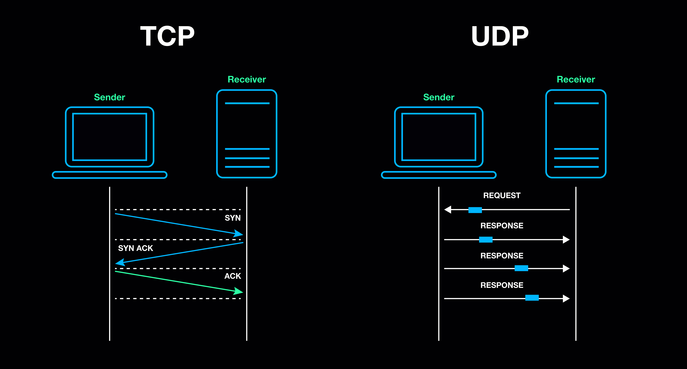

متاسفانه حدود دو هفته است که ارتباط اینترنت ایران قطع شده و خبرهای ناگواری باعث شده هیچ کدام ما حال و روز خوبی نداشته باشیم. دسترسی آزاد به اینترنت از حقوق اولیه و اساسی همه انسان‌هاست. به امید روزهای بهتر.

اینجا قصد دارم توضیح بدهم که چرا پس از برقراری محدود و مختصر ارتباط پیامهای ارسالی از داخل ایران راحت‌تر در خارج از کشور دریافت می‌شوند و معمولا مسیر برگشت یعنی پیام‌هایی که از خارج از ایران ارسال می‌شوند سخت‌تر به مقصد می‌رسند.

# نامتقارن شدن مسیرهای اینترنت (Asymmetric Routing)

در شرایط بحران یا محدودسازی، مسیرهای اینترنت معمولاً نامتقارن می‌شوند. یعنی مسیر خروجی از ایران (ارسال داده به خارج) کمتر محدود می‌شود، اما مسیر ورودی به ایران (دریافت داده از خارج) شدیدتر فیلتر یا مسدود می‌شود. دلیلش این است که کنترل اطلاعات ورودی برای سیستم‌های نظارتی اهمیت بیشتری دارد.

به زبان ساده، «فرستادن» راحت‌تر از «دریافت کردن» می‌شود. نتیجه این نامتقارن بودن این است که درخواست از داخل کشور می‌رود، اما پاسخ از خارج ممکن است هرگز برنگردد.

مسیرهای اینترنت در زمان قطعی نامتقارن (Asymmetric Routing) می‌شوند. مسیر خروجی از ایران معمولاً بازتر است ولی مسیر ورودی بیشتر محدود می‌شود. از طرف دیگر فیلترشکن‌ها و VPNها در اینترنت ناپایدار سخت‌تر می‌توانند ارتباط ورودی را دوباره برقرار کنند، مخصوصاً اگر UDP باشند یا keep-alive ضعیفی داشته باشند. البته DNS و سرورهای خارجی هم گاهی جواب را از مسیری می‌فرستند که راه برگشتش به ایران بسته است.

# فایروال stateless (بدون وضعیت)

فایروال stateless هر بسته اینترنت را کاملاً مستقل بررسی می‌کند. یعنی برایش مهم نیست قبل از این بسته چه چیزی رد و بدل شده است. فقط نگاه می‌کند این بسته با قوانین تعریف‌ شده هم‌خوانی دارد یا نه.

## مزایا

سادگی مهم‌ترین مزیت این نوع فایروال است. پیاده‌سازی آن راحت است، مصرف منابع کمی دارد و سرعت پردازش بالاست. به همین دلیل برای روترهای ساده یا شبکه‌هایی که حجم ترافیک بسیار بالایی دارند مناسب است.

## معایب

مشکل اصلی این فایروال این است که «کانتکست» ندارد. نمی‌فهمد یک بسته ادامه چه ارتباطی است. به همین دلیل قوانینش یا باید خیلی باز باشند (که امنیت را کم می‌کند) یا خیلی سخت‌گیرانه (که باعث قطع ارتباط‌های سالم می‌شود) و برای کنترل دقیق ترافیک ورودی چندان مناسب نیست.

# فایروال stateful (دارای وضعیت)

فایروال stateful برخلاف stateless، حافظه دارد. وقتی یک ارتباط از داخل شبکه شروع می‌شود، فایروال آن را در جدولی به نام state table ثبت می‌کند. از آن به بعد فقط بسته‌هایی اجازه عبور دارند که ادامه همان ارتباط ثبت‌شده باشند.

اگر بسته‌ای از خارج وارد شود که هیچ ارتباط قبلی برایش وجود نداشته باشد، فایروال آن را مشکوک تلقی می‌کند و معمولاً مسدود می‌کند.

## مزایا

امنیت بالاتر مهم‌ترین مزیت فایروال stateful است. چون فقط اجازه ادامه ارتباط‌هایی را می‌دهد که «قانونی» شروع شده‌اند. کنترل ترافیک ورودی بسیار دقیق‌تر است و احتمال سوءاستفاده کمتر می‌شود.

## معایب

این نوع فایروال پیچیده‌تر است و منابع بیشتری مصرف می‌کند. علاوه بر این، به ناپایداری شبکه حساس است. اگر ارتباط قطع و وصل شود یا بسته‌ای گم شود، ممکن است state پاک شود و بسته‌های بعدی به‌اشتباه مسدود شوند.

# مقایسه خلاصه stateless و stateful

به طور خلاصه، stateless ساده و سریع است ولی دیدی نسبت به ارتباط ندارد. stateful هوشمندتر و امن‌تر است اما در اینترنت ناپایدار می‌تواند باعث قطع ارتباط‌های سالم شود. در محدودیت‌های اینترنت ایران بیشتر از فایروال‌های stateful استفاده می‌شود، چون کنترل ترافیک ورودی برایشان اولویت دارد.

در محدودیت‌های اینترنت ایران احتمالا بیشتر از فایروال stateful استفاده می‌شود، یعنی اگر ارتباط از داخل کشور شروع بشود، جوابش از خارج راحت‌تر برمی‌گرده، اما اگر کسی از خارج بخواهد بدون شروع قبلی به داخل پیام بفرستد، معمولاً فایروال مسدودش می‌کند.

برای همین پیام‌هایی که از داخل به خارج فرستاده می‌شوند، شانس رسیدن بیشتری دارند تا پیام‌هایی که از خارج به داخل ارسال می‌شوند.

# TCP و پیام‌های اصلی آن

بیشتر ارتباط‌های اینترنتی (وب، پیام‌رسان‌ها، ایمیل) روی پروتکلی به نام TCP انجام می‌شوند. TCP قبل از ارسال داده یک فرایند مشخص برای برقراری ارتباط دارد.

ابتدا بسته‌ای به نام SYN ارسال می‌شود که یعنی «می‌خواهم ارتباط برقرار کنم». طرف مقابل با SYN-ACK جواب می‌دهد، یعنی «درخواستت را گرفتم و آماده‌ام». سپس فرستنده با ACK تأیید می‌کند و ارتباط برقرار می‌شود. بعد از آن داده‌های واقعی یا DATA رد و بدل می‌شوند. در پایان، یکی از دو طرف با FIN اعلام می‌کند که ارتباط تمام شده و اتصال بسته می‌شود.

این ساختار مشخص باعث می‌شود فایروال‌های stateful بتوانند تشخیص دهند کدام ارتباط معتبر است.

    

# UDP و مفهوم pseudo-state

UDP برخلاف TCP هیچ‌کدام از این مراحل را ندارد. نه شروع مشخصی دارد، نه تأیید، نه پایان. هر بسته UDP مستقل ارسال می‌شود، بدون اینکه طرف مقابل حتماً پاسخی بدهد.

برای اینکه UDP به‌طور کامل مسدود نشود، فایروال‌های stateful چیزی به نام pseudo-state می‌سازند. یعنی اگر از داخل شبکه یک بسته UDP به مقصدی خاص ارسال شود، فایروال برای مدت کوتاهی اجازه می‌دهد پاسخ از همان مقصد برگردد. اگر این زمان تمام شود یا اینترنت ناپایدار باشد، بسته‌های بعدی که از خارج می‌آیند دیگر معتبر شناخته نمی‌شوند و drop می‌شوند.

به همین دلیل ارتباط‌های مبتنی بر UDP، مثل بعضی VPNها، تماس‌های صوتی و تصویری، در شرایط قطع و وصل اینترنت خیلی زود ناپایدار می‌شوند.

## جمع‌بندی

اینکه پیام از داخل ایران به خارج راحت‌تر می‌رسد اما از خارج به داخل نه، نتیجه ترکیب چند عامل است: نامتقارن شدن مسیرهای اینترنت، استفاده گسترده از فایروال‌های stateful، حساسیت این فایروال‌ها به ناپایداری شبکه، و تفاوت ذاتی TCP و UDP. این رفتار نه باگ است و نه تصادفی، بلکه حاصل طراحی و سیاست‌گذاری در سطح زیرساخت شبکه است.

